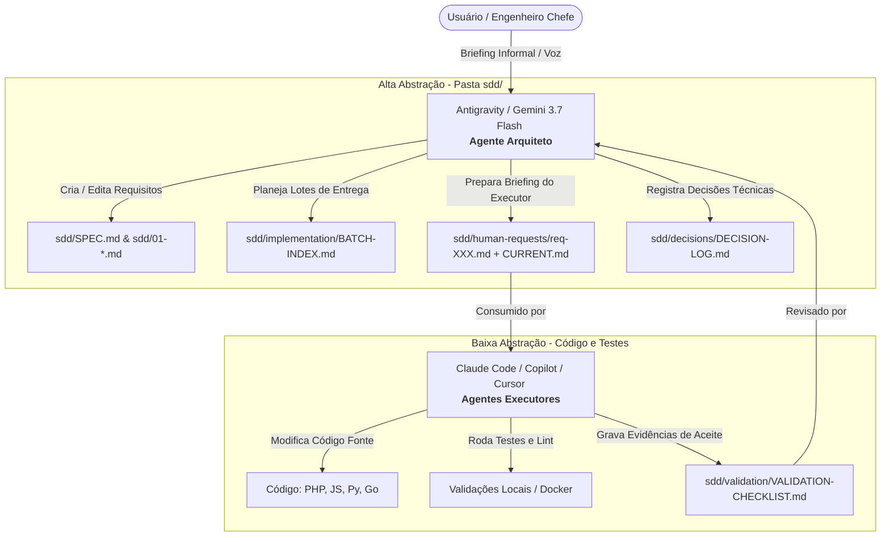

<p align="right">
  <a href="README.md">English</a> • <strong>Português (Brasil)</strong>
</p>

# Conn2Flow AI Workspace: Double Agent SDD Framework 🚀

Seja bem-vindo ao **Conn2Flow AI Workspace**! Este repositório centraliza templates, configurações e documentação de ponta para implementar a metodologia **Spec-Driven Development (SDD)** através de um ecossistema de **Agente Duplo + Humano-no-Loop**.

Este framework é open-source, modular e foi projetado para ser injetado em **qualquer repositório de software** (independente de linguagem ou stack) para otimizar drasticamente a velocidade de engenharia com inteligência artificial, mantendo o controle arquitetural absoluto.


---

## 💡 O Conceito: Modelo de Agente Duplo

Trabalhar com IA gerando código de forma isolada geralmente leva a refatorações desnecessárias, regressões e perda de visão sistêmica. Este workspace resolve isso dividindo as tarefas de IA em dois papéis distintos e complementares que operam sobre uma fonte única da verdade local (`sdd/`):



1. **O Arquiteto (Macro-Orquestrador - Antigravity / Gemini 3.7 Flash)**:
   - Foca em alto nível. Recebe as necessidades humanas (áudios transcritos, conversas informais) e as traduz em requisitos técnicos padronizados.
   - Gerencia a especificação do sistema (`sdd/SPEC.md`), registra decisões de design no histórico e escreve o briefing operacional de execução em `sdd/human-requests/`.
   - **Regra de Ouro**: Nunca realiza commits ou envia código direto. Suas modificações ficam em aberto para revisão visual de diffs pelo usuário humano.
2. **O Executor (Micro-Operador - Claude Code / Copilot / Cursor)**:
   - Foca em baixo nível. Lê o briefing e a especificação gerada pelo Arquiteto.
   - Implementa o código, roda lints, executa testes locais e preenche os logs de validação.
3. **O Humano-no-Loop (Você)**:
   - Direciona o Arquiteto e inspeciona o diff de código gerado pelo Executor diretamente no Git do editor antes de consolidar a tarefa.

---

## 📂 Estrutura Semântica do Workspace

Este repositório é organizado em diretórios semânticos com suporte bilíngue (`pt-br` e `en`):

* **`templates/`** (`pt-br/` e `en/`):
  - `sdd-boilerplate/`: O esqueleto inicial canônico da pasta `sdd/` para novos projetos.
  - `templates/spec-driven-project-claude-kit`: Regras, subagentes e comandos sob demanda para o **Claude Code** em projetos SDD.
  - `templates/spec-driven-project-copilot-kit`: Prompts, instruções do sistema e agentes para o **GitHub Copilot** em projetos SDD.
  - `templates/spec-driven-project-cursor-kit`: Regras de projeto (`.cursor/rules/sdd.mdc`), compatibilidade legada (`.cursorrules`) e skills sob demanda (`.cursor/skills/`) para o **Cursor IDE**.
  - `templates/spec-driven-project-gemini-kit`: `GEMINI.md`, configuração do Gemini CLI (`.gemini/settings.json`), skills nativas (`.gemini/skills/`), `.geminiignore` e compatibilidade com Code Assist via `.aiexclude`.
  - `templates/spec-driven-project-codex-kit`: `CODEX.md`, `AGENTS.md`, configuração do OpenAI Codex/GPT (`.codex/settings.json`) e skills nativas (`.codex/skills/`).
  - `templates/private-project-claude-kit`: Configurações de IA do Claude para repositórios privados sobrepostos ao core.
  - `templates/private-project-copilot-kit`: Configurações de IA do Copilot para repositórios privados sobrepostos ao core.
* **`docs/`** (`pt-br/` e `en/`): Manuais técnicos completos, catálogo de skills, playbook de orquestração e guia CLI/MCP.
* **`scripts/`**: Scripts de automação em PowerShell (`.ps1`) e Bash (`.sh`) para instalar os kits instantaneamente em qualquer repositório.
* **`mcp-hub/`**: Servidor MCP dockerizado para conexão inteligente e despacho de tarefas entre IDEs e modelos.
* **`sdd/`**: Governança Spec-Driven Development viva que rege este próprio workspace.

---

## 🛠️ Como Adotar no seu Projeto

A adoção do framework é simples e automatizada. Abra o terminal na raiz deste workspace e rode os comandos correspondentes ao seu ambiente.

### 1. Claude Code (Recomendado)
Para injetar o controle SDD e as ferramentas do Claude Code no seu projeto:
- **Windows (PowerShell)**:
  ```powershell
  scripts/install-spec-driven-claude-kit.ps1 -TargetRepoPath "C:/caminho/do/seu-repositorio" -AgentPrefix "seuprojeto" -Language "pt-br"
  ```
- **Linux / macOS (Bash)**:
  ```bash
  scripts/install-spec-driven-claude-kit.sh /caminho/do/seu-repositorio --agent-prefix seuprojeto --language pt-br
  ```

### 2. GitHub Copilot
Para injetar as instruções de sistema, agentes de chat e prompts no GitHub Copilot do seu projeto:
- **Windows (PowerShell)**:
  ```powershell
  scripts/install-spec-driven-copilot-kit.ps1 -TargetRepoPath "C:/caminho/do/seu-repositorio" -AgentPrefix "seuprojeto" -Language "pt-br"
  ```
- **Linux / macOS (Bash)**:
  ```bash
  scripts/install-spec-driven-copilot-kit.sh /caminho/do/seu-repositorio --agent-prefix seuprojeto --language pt-br
  ```

### 3. Cursor IDE
Para injetar a regra MDC principal (`.cursor/rules/sdd.mdc`), as skills sob demanda (`.cursor/skills/`) e o arquivo legado compatível `.cursorrules`:
- **Windows (PowerShell)**:
  ```powershell
  scripts/install-spec-driven-cursor-kit.ps1 -TargetRepoPath "C:/caminho/do/seu-repositorio" -AgentPrefix "seuprojeto" -Language "pt-br"
  ```
- **Linux / macOS (Bash)**:
  ```bash
  scripts/install-spec-driven-cursor-kit.sh /caminho/do/seu-repositorio --agent-prefix seuprojeto --language pt-br
  ```

### 4. Antigravity / Gemini 3.7 Flash
Para injetar as instruções do Gemini (`GEMINI.md`), configuração (`.gemini/settings.json`), skills nativas sob demanda (`.gemini/skills/`), guia de estilo, `.geminiignore` e compatibilidade `.aiexclude`:
- **Windows (PowerShell)**:
  ```powershell
  scripts/install-spec-driven-gemini-kit.ps1 -TargetRepoPath "C:/caminho/do/seu-repositorio" -AgentPrefix "seuprojeto" -Language "pt-br"
  ```
- **Linux / macOS (Bash)**:
  ```bash
  scripts/install-spec-driven-gemini-kit.sh /caminho/do/seu-repositorio --agent-prefix seuprojeto --language pt-br
  ```

### 5. OpenAI Codex / GPT (VS Code)
Para injetar as instruções do OpenAI Codex (`CODEX.md`, `AGENTS.md`), configuração (`.codex/settings.json`) e skills nativas sob demanda (`.codex/skills/`):
- **Windows (PowerShell)**:
  ```powershell
  scripts/install-spec-driven-codex-kit.ps1 -TargetRepoPath "C:/caminho/do/seu-repositorio" -AgentPrefix "seuprojeto" -Language "pt-br"
  ```
- **Linux / macOS (Bash)**:
  ```bash
  scripts/install-spec-driven-codex-kit.sh /caminho/do/seu-repositorio --agent-prefix seuprojeto --language pt-br
  ```

*Nota: O parâmetro `-AgentPrefix` é opcional e serve para renomear os subagentes padrão (ex: `seuprojeto-sdd-coordinator`). O parâmetro `-Language` (ou `--language`) permite alternar entre `en` (inglês) e `pt-br` (português).*

---

## 🚦 A Fronteira do Ping-Pong (Regras de Escrita)

Para evitar que o agente executor reescreva especificações técnicas ou tome decisões estruturais sem autorização, as regras de IA inclusas nos kits delimitam uma fronteira clara:

* 🟢 **Área Operacional (Executor Grava)**: O Executor está livre para atualizar a trilha de progresso das tarefas em `sdd/implementation/` e preencher os logs de validação/testes em `sdd/validation/`.
* 🔴 **Área Normativa (Executor Apenas Lê)**: O Executor é estritamente proibido de editar especificações numeradas (`sdd/SPEC.md`, `sdd/0X-*.md`) ou o log de decisões (`sdd/decisions/DECISION-LOG.md`). Se o executor identificar um erro de especificação, ele deve relatar ao usuário para que o Arquiteto IA abra uma proposta de Change Request (`CR-XXX.md`).

---

## 🧠 Memórias de Engenharia (Chefia e Execução)

Para evitar a perda de contexto e eliminar a necessidade de repetição lógica entre as sessões dos agentes de IA, o Double Agent SDD Framework introduz dois diários de engenharia opcionais:
*   **Memória do Engenheiro Chefe (`MEMORIA-ENGENHARIA-CHEFIA.md` / `ENGINEERING-MEMORY-CHIEF.md`)**: Apenas leitura para o Executor IA. Contém orientações de estilo, convenções de código, limites arquiteturais e restrições de negócio ditadas pelo Engenheiro Chefe Humano.
*   **Memória de Execução (`MEMORIA-ENGENHARIA-EXECUCAO.md` / `ENGINEERING-MEMORY-EXECUTION.md`)**: Leitura e escrita para o Executor IA. O Executor registra aqui notas de dependência local, comportamentos do compilador, hacks de banco de dados e bugs resolvidos ao término de cada tarefa.

As instruções de sistema nos kits orientam automaticamente o agente a:
1.  **Ler as memórias** no início da sessão para alinhar o contexto.
2.  **Registrar aprendizados** e detalhes do ambiente local na Memória de Execução ao finalizar uma tarefa.
3.  **Respeitar o limite** da Memória da Chefia, nunca a alterando sem ordem direta do usuário humano.

---

## 🌾 Memory Gardening e Colheita de Skills

Conforme os projetos evoluem, as memórias de execução podem crescer em excesso (~100 KB+), consumindo tokens valiosos de prompt no início de cada sessão. O framework implementa o protocolo **Memory Gardening**:
*   **Limites de Poda Idempotente**:
    - **Alerta Preventivo**: Acionado a partir de **35 KB / ~100 linhas**.
    - **Teto Mandatório de Poda**: Execução obrigatória ao atingir **50 KB / ~150 linhas**.
    - **Alvo Pós-Poda**: Reduz o arquivo para **~15 KB** (preservando as **12 a 15 tarefas mais recentes**).
*   **Colheita de Skills**: Os padrões extraídos são destilados em **Skills** reutilizáveis acionadas sob demanda:
    - **Core Skills**: Armazenadas no `conn2flow-ai-workspace` para padrões gerais do framework (ex: `c2f-json-resources-sync`, `c2f-widget-development`, `c2f-tailwind-css-architecture`).
    - **Skills de Projeto**: Armazenadas em `.claude/skills/`, `.cursor/skills/`, `.github/skills/`, `.gemini/skills/` e `.codex/skills/` para regras específicas carregadas dinamicamente (ex: `lumix-tailwind-v4`, `transformamp-wp-etl`).
*   **Eficiência de Tokens**: Mantém o contexto de prompt rápido e econômico, salvando até 80% dos tokens de bootstrap enquanto retém o histórico relevante.

---

## 🛠️ Acervo de Core Skills do Conn2Flow (26 Skills de Engenharia)

O workspace centraliza um catálogo completo de **26 Skills Core do Conn2Flow** (`c2f-*`) + **7 SDD Workflow Skills** (totalizando **33 Skills**), injetadas automaticamente em todos os kits (`.claude/skills/`, `.cursor/skills/`, `.github/skills/`, `.gemini/skills/` e `.codex/skills/`) para equipar qualquer agente de IA com inteligência técnica nativa sobre o ecossistema:

1. **Recursos, Variáveis & Frontend**:
   - `c2f-resources-system`: Arquitetura de compilação de 11 tipos de recursos (`resources/`) para `*Data.json` e sincronização SQL declarativa.
   - `c2f-variables-system`: **[NOVO]** Governança de textos, mensagens de erro, alertas de warning e i18n via `variables.json`. Proíbe strings hardcoded em PHP/HTML/JS.
   - `c2f-html-css-pages-and-components`: Regra mandatória que proíbe arquivos `.html`, `.css` e `.md` estáticos soltos fora de `resources/`.
   - `c2f-tailwind-css-architecture`: Governança do Tailwind CSS v4 para cascata responsiva, `css_compiled`, templates dinâmicos e builds via `c2f resources:sync`.
   - `c2f-modelo-templates`: Processamento de templates HTML e células repetitivas (`modelo_var_troca`, `<!-- cel < -->`, `modelo_var_in`).
   - `c2f-javascript-ajax`: Contrato canônico de integração AJAX (Vanilla Fetch, `URLSearchParams`, `FormData`), prevenção de erro 403 CSRF (`ajax: 'sim'`) e lifecycle PHP (`interface_ajax_iniciar`/`interface_ajax_finalizar`).
   - `c2f-multilingual-system`: Sistema híbrido de i18n (`pt-br`, `en`, `es`), chave natural `language` e diretórios físicos.
   - `c2f-preview-modals-system`: Modais dinâmicos de pré-visualização de componentes e layouts no gestor.
   - `c2f-widget-development`: Padrão de desenvolvimento e injeção de widgets no sistema.

2. **Módulos, Backend & Banco de Dados**:
   - `c2f-module-crud-scaffolding`: **[NOVO]** Scaffold canônico para criação de novos módulos CRUD baseado na arquitetura viva de `modulos-grupos`.
   - `c2f-environment-configuration`: **[NOVO]** Governança de credenciais sensíveis e templates `.env` via `config.php` e `$_CONFIG`.
   - `c2f-gestor-functions`: Funções da biblioteca `gestor.php` (`gestor_componente`, `gestor_variaveis`, `gestor_redirecionar`, layouts e sessões).
   - `c2f-global-variables`: Mapa de superglobais `$_GESTOR` (runtime), `$_CONFIG` (sistema), `$_BANCO` (conexão) e `$_ENV` (infra).
   - `c2f-database-operations`: CRUD via `banco.php` (`banco_select_name`, `banco_update`) e estrutura de Migrações Phinx.
   - `c2f-database-testing`: Testes automatizados e harness SQLite para banco de dados.
   - `c2f-hooks-system`: Sistema de Actions (`hook_do_action`) vs Filters (`hook_apply_filters`), registro em JSON e controladores.
   - `c2f-interface-v2-architecture`: Construtor de telas administrativas de CRUD V2 com `interface.php`.
   - `c2f-json-resources-sync` & `c2f-mysql-utf8-emoji-encoding`: Codificação UTF-8mb4 e sincronização de metadados JSON.

3. **Projetos, Plugins & Automação**:
   - `c2f-projects-system`: Pipeline de deploy de projetos privados via OAuth API (`/api/project/update`), ZIP e execução inline.
   - `c2f-plugin-architecture`: Manifesto `plugin.json`, escopamento e ciclo de vida (`_install`/`_uninstall`) de plugins públicos e privados.
   - `c2f-system-tasks`: Central de tarefas de automação do sistema (`.vscode/tasks.json`) para Docker, builds e deploys.
   - `c2f-dev-scripts`: Convenções para uso e criação de scripts CLI/Bash/PHP em `ai-workspace/scripts/`.
   - `c2f-docker-environment`: Inspeção de logs `/var/log/php_errors.log` e comandos CLI no container `conn2flow-app`.
   - `c2f-gd-image-safety`: Manipulação segura de imagens com biblioteca GD.

4. **Governança de Documentação**:
   - `c2f-documentation-governance`: Estabelece o **Princípio da Autoridade do Código-Fonte** sobre documentações, instruindo agentes a auditar arquivos `.php`/`.js` reais e evitar divergências de código.

---

## ⚡ Guia Rápido de Uso: CLI `c2f`, MCP Hub & Worktrees

O framework disponibiliza uma suíte completa de automação multiplataforma:

### 1. Core CLI (`c2f`) no Terminal:
* **Git Bash / Linux / macOS**: `./c2f <comando>` (ex: `./c2f resources:sync`, `./c2f ai:sync`, `./c2f module:create <id>`)
* **Windows PowerShell**: `.\c2f.ps1 <comando>`
* **Windows CMD**: `c2f <comando>`

### 2. Servidor MCP Hub Dual-Mode (Docker com Auto-Start):
```bash
cd mcp-hub
docker compose up -d --build
```
*Permite que Antigravity, Claude Code e Cursor conversem entre si e executem tarefas nos modos Supervisionado (Chat) e Headless (Background).*

### 3. Git Worktrees para Agentes Paralelos:
```powershell
.\scripts\git\create-agent-worktree.ps1 -RepoPath "C:\caminho\conn2flow" -BranchName "feat-novo-modulo"
```

---

## 📚 Central de Documentação Técnica (`docs/`)

Para aprofundamento técnico, consulte os manuais dedicados na pasta `docs/pt-br/`:
* 🚀 [Guia Rápido do Core CLI, MCP Hub & Worktrees](docs/pt-br/GUIA-RAPIDO-CLI-E-MCP.md) — Tutorial passo a passo completo.
* 🧭 [Playbook de Orquestração Multi-Agentes & IDEs](docs/pt-br/PLAYBOOK-ORQUESTRACAO-MULTI-AGENTES.md) — Como alternar entre Claude, Cursor, Copilot e Antigravity.
* 🏛️ [Arquitetura de Agente Duplo](docs/pt-br/ARQUITETURA-AGENTE-DUPLO.md) — Separação de papéis, fronteiras e governança.
* 🧩 [Catálogo Completo de Skills](docs/pt-br/CATALOGO-DE-SKILLS.md) — Guia detalhado de todas as 33 skills com contratos.
* 🔮 [Roteiro de Evolução Futura](docs/pt-br/ROTEIRO-EVOLUCAO-FUTURA.md) — Servidores MCP, CI/CD de auto-cura e estratégia educacional.

👉 *Procurando a documentação em Inglês? Acesse a [Central de Documentação em Inglês](docs/en/README.md).*


---

## 🧹 Otimização de Contexto e Arquivamento SDD

Para evitar a degradação da atenção do agente devido ao excesso de informações nos prompts (bloating) e manter o consumo de tokens altamente eficiente, o framework implementa um limite ativo de tamanho:
*   **Limite de 25 Itens Ativos**: Arquivos de controle centrais como `DECISION-LOG.md`, `BATCH-INDEX.md` e `VALIDATION-CHECKLIST.md` mantêm os **25 itens ativos mais recentes** (com teto de 35 KB a 50 KB), preservando histórico relevante e eliminando podas excessivas.
*   **Estrutura de Arquivos Archive**: Registros históricos antigos que ultrapassam o limite são movidos para a subpasta `/archive/` correspondente a cada diretório (ex: `sdd/decisions/archive/`, `sdd/implementation/archive/`, etc.).
*   **Instalação Automatizada**: Os scripts de instalação (`scripts/install-spec-driven-*.ps1` / `.sh`) detectam pastas `sdd/` preexistentes e provisionam de forma segura essas subpastas de arquivos junto com seus `README.md` explicativos padrão, atualizando repositórios antigos de forma automática e não destrutiva.


---

## 🧊 Backlog de Ideias e Intake Gate

O módulo opcional `sdd/backlog/` incuba Features, Epics, Spikes/Pesquisas e propostas de Arquitetura nos estados `ICEBOX`, `IN-DISCUSSION` e `READY`.

Itens do backlog nunca são executáveis por si só. Executores podem lê-los como contexto, mas a implementação é proibida até promoção explícita do Usuário para `sdd/human-requests/`, atualização de `CURRENT.md` e associação a um batch executável. Os instaladores provisionam essa estrutura de forma não destrutiva em projetos SDD existentes.

---

## ⚖️ Licença

Este projeto é disponibilizado sob a licença MIT. Sinta-se livre para usar, modificar e distribuir na sua empresa ou comunidade.
