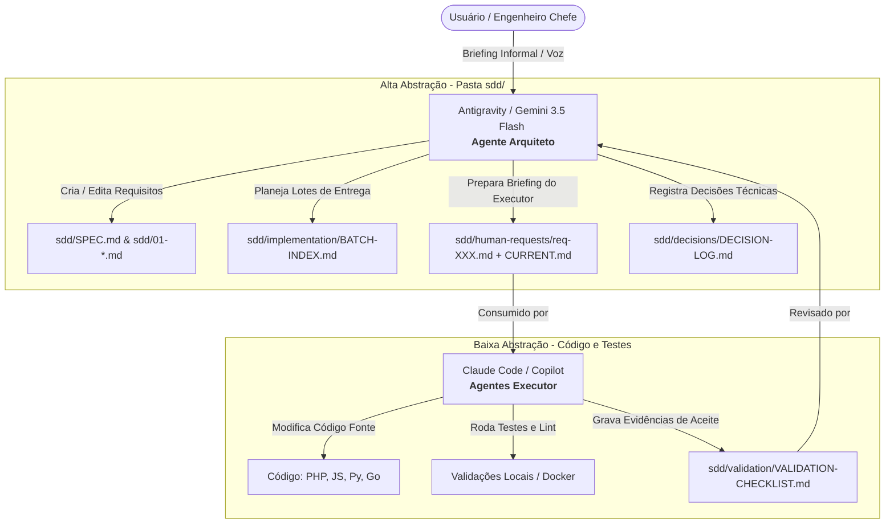

# Conn2Flow AI Workspace: Double Agent SDD Framework 🚀

Seja bem-vindo ao **Conn2Flow AI Workspace**! Este repositório centraliza templates, configurações e documentação de ponta para implementar a metodologia **Spec-Driven Development (SDD)** através de um ecossistema de **Agente Duplo + Humano-no-Loop**.

Este framework é open-source, modular e foi projetado para ser injetado em **qualquer repositório de software** (independente de linguagem ou stack) para otimizar drasticamente a velocidade de engenharia com inteligência artificial, mantendo o controle arquitetural absoluto.

---

## 💡 O Conceito: Modelo de Agente Duplo

Trabalhar com IA gerando código de forma isolada geralmente leva a refatorações desnecessárias, regressões e perda de visão sistêmica. Este workspace resolve isso dividindo as tarefas de IA em dois papéis distintos e complementares que operam sobre uma fonte única da verdade local (`sdd/`):



1. **O Arquiteto (Macro-Orquestrador - Antigravity / Gemini)**:
   - Foca em alto nível. Recebe as necessidades humanas (áudios transcritos, conversas informais) e as traduz em requisitos técnicos padronizados.
   - Gerencia a especificação do sistema (`sdd/SPEC.md`), registra decisões de design no histórico e escreve o briefing operacional de execução em `sdd/human-requests/`.
   - **Regra de Ouro**: Nunca realiza commits ou envia código direto. Suas modificações ficam em aberto para revisão visual de diffs pelo usuário humano.
2. **O Executor (Micro-Operador - Claude Code / Copilot)**:
   - Foca em baixo nível. Lê o briefing e a especificação gerada pelo Arquiteto.
   - Implementa o código, roda lints, executa testes locais e preenche os logs de validação.
3. **O Humano-no-Loop (Você)**:
   - Direciona o Arquiteto e inspeciona o diff de código gerado pelo Executor diretamente no Git do editor antes de consolidar a tarefa.

---

## 📂 Estrutura do Workspace

Este repositório organiza os kits de IA prontos para uso em dois idiomas (`pt-br` e `en`):

* **`pt-br/`** & **`en/`**:
  - `sdd-boilerplate/`: O esqueleto inicial limpo da pasta `sdd/` que governa seu projeto.
  - `templates/spec-driven-project-claude-kit`: Regras, subagentes e comandos sob demanda para rodar o **Claude Code** em projetos SDD.
  - `templates/spec-driven-project-copilot-kit`: Prompts, instruções do sistema e agentes para rodar o **GitHub Copilot** em projetos SDD.
  - `templates/spec-driven-project-cursor-kit`: Regras de projeto (`.cursor/rules/sdd.mdc`), compatibilidade legada (`.cursorrules`) e skills sob demanda (`.cursor/skills/`) para rodar o **Cursor IDE** em projetos SDD.
  - `templates/spec-driven-project-gemini-kit`: `GEMINI.md`, configuração oficial do Gemini CLI (`.gemini/settings.json`), `.geminiignore` e compatibilidade com Code Assist via `.aiexclude`.
  - `templates/private-project-claude-kit`: Configuração do Claude Code para cenários de repositórios privados.
  - `templates/private-project-copilot-kit`: Configuração do GitHub Copilot para cenários de repositórios privados.
* **`scripts/`**: Scripts de automação em PowerShell (`.ps1`) e Bash (`.sh`) para instalar os kits instantaneamente em qualquer repositório alvo do seu computador, com suporte à seleção de idioma.

---

## 🛠️ Como Adotar no seu Projeto

A adoção do framework é simples e automatizada. Abra o terminal na raiz deste workspace e rode os comandos correspondentes ao seu ambiente.

### 1. Claude Code (Recomendado)
Para injetar o controle SDD e as ferramentas do Claude Code no seu projeto:
- **Windows (PowerShell)**:
  ```powershell
  scripts/install-spec-driven-claude-kit.ps1 -TargetRepoPath "C:/caminho/do/seu-repositorio" -AgentPrefix "seuprojeto" -Language "pt-br"
  ```
- **Linux / macOS (Bash)**:
  ```bash
  scripts/install-spec-driven-claude-kit.sh /caminho/do/seu-repositorio --agent-prefix seuprojeto --language pt-br
  ```

### 2. GitHub Copilot
Para injetar as instruções de sistema, agentes de chat e prompts no GitHub Copilot do seu projeto:
- **Windows (PowerShell)**:
  ```powershell
  scripts/install-spec-driven-copilot-kit.ps1 -TargetRepoPath "C:/caminho/do/seu-repositorio" -AgentPrefix "seuprojeto" -Language "pt-br"
  ```
- **Linux / macOS (Bash)**:
  ```bash
  scripts/install-spec-driven-copilot-kit.sh /caminho/do/seu-repositorio --agent-prefix seuprojeto --language pt-br
  ```

### 3. Cursor IDE
Para injetar a regra MDC principal (`.cursor/rules/sdd.mdc`), as skills sob demanda (`.cursor/skills/`) e o arquivo legado compatível `.cursorrules`:
- **Windows (PowerShell)**:
  ```powershell
  scripts/install-spec-driven-cursor-kit.ps1 -TargetRepoPath "C:/caminho/do/seu-repositorio" -AgentPrefix "seuprojeto" -Language "pt-br"
  ```
- **Linux / macOS (Bash)**:
  ```bash
  scripts/install-spec-driven-cursor-kit.sh /caminho/do/seu-repositorio --agent-prefix seuprojeto --language pt-br
  ```

### 4. Antigravity / Gemini Pro
Para injetar as instruções do Gemini (`GEMINI.md`), configuração (`.gemini/settings.json`), guia de estilo, `.geminiignore` e compatibilidade `.aiexclude`:
- **Windows (PowerShell)**:
  ```powershell
  scripts/install-spec-driven-gemini-kit.ps1 -TargetRepoPath "C:/caminho/do/seu-repositorio" -AgentPrefix "seuprojeto" -Language "pt-br"
  ```
- **Linux / macOS (Bash)**:
  ```bash
  scripts/install-spec-driven-gemini-kit.sh /caminho/do/seu-repositorio --agent-prefix seuprojeto --language pt-br
  ```

*Nota: O parâmetro `-AgentPrefix` é opcional e serve para renomear os subagentes padrão (ex: `seuprojeto-sdd-coordinator`). O parâmetro `-Language` (ou `--language`) permite alternar entre `en` (inglês) e `pt-br` (português).*

---

## 🚦 A Fronteira do Ping-Pong (Regras de Escrita)

Para evitar que o agente executor reescreva especificações técnicas ou tome decisões estruturais sem autorização, as regras de IA inclusas nos kits delimitam uma fronteira clara:

* 🟢 **Área Operacional (Executor Grava)**: O Executor está livre para atualizar a trilha de progresso das tarefas em `sdd/implementation/` e preencher os logs de validação/testes em `sdd/validation/`.
* 🔴 **Área Normativa (Executor Apenas Lê)**: O Executor é estritamente proibido de editar especificações numeradas (`sdd/SPEC.md`, `sdd/0X-*.md`) ou o log de decisões (`sdd/decisions/DECISION-LOG.md`). Se o executor identificar um erro de especificação, ele deve relatar ao usuário para que o Arquiteto IA abra uma proposta de Change Request (`CR-XXX.md`).

---

## 🧠 Memórias de Engenharia (Chefia e Execução)

Para evitar a perda de contexto e eliminar a necessidade de repetição lógica entre as sessões dos agentes de IA, o Double Agent SDD Framework introduz dois diários de engenharia opcionais:
*   **Memória do Engenheiro Chefe (`MEMORIA-ENGENHARIA-CHEFIA.md` / `ENGINEERING-MEMORY-CHIEF.md`)**: Apenas leitura para o Executor IA. Contém orientações de estilo, convenções de código, limites arquiteturais e restrições de negócio ditadas pelo Engenheiro Chefe Humano.
*   **Memória de Execução (`MEMORIA-ENGENHARIA-EXECUCAO.md` / `ENGINEERING-MEMORY-EXECUTION.md`)**: Leitura e escrita para o Executor IA. O Executor registra aqui notas de dependência local, comportamentos do compilador, hacks de banco de dados e bugs resolvidos ao término de cada tarefa.

As instruções de sistema nos kits orientam automaticamente o agente a:
1.  **Ler as memórias** no início da sessão para alinhar o contexto.
2.  **Registrar aprendizados** e detalhes do ambiente local na Memória de Execução ao finalizar uma tarefa.
3.  **Respeitar o limite** da Memória da Chefia, nunca a alterando sem ordem direta do usuário humano.

---

## 🌾 Memory Gardening e Colheita de Skills

Conforme os projetos evoluem, as memórias de execução podem crescer em excesso (~100 KB+), consumindo tokens valiosos de prompt no início de cada sessão. O framework implementa o protocolo **Memory Gardening**:
*   **Gatilho de Poda**: Quando uma memória de execução ultrapassa ~15 KB ou ~50 linhas, os aprendizados recorrentes são extraídos e podados.
*   **Colheita de Skills**: Os padrões extraídos são destilados em **Skills** reutilizáveis acionadas sob demanda:
    - **Core Skills**: Armazenadas no `conn2flow-ai-workspace` para padrões gerais do framework (ex: `c2f-json-resources-sync`, `c2f-widget-development`, `c2f-mysql-utf8-emoji-encoding`).
    - **Skills de Projeto**: Armazenadas em `.claude/skills/` e `.cursor/skills/` para regras específicas carregadas dinamicamente (ex: `lumix-tailwind-v4`, `transformamp-wp-etl`).
*   **Eficiência de Tokens**: A poda reduz o arquivo de memória ativa para ~5 KB (mantendo apenas as 3–5 tarefas mais recentes), economizando até 90% dos tokens de inicialização do contexto enquanto retém o conhecimento profundo sob demanda.

---

## 🧹 Otimização de Contexto e Arquivamento SDD

Para evitar a degradação da atenção do agente devido ao excesso de informações nos prompts (bloating) e manter o consumo de tokens altamente eficiente, o framework implementa um limite ativo de tamanho:
*   **Limite de 10 Itens**: Arquivos de controle centrais como `DECISION-LOG.md`, `BATCH-INDEX.md` e `VALIDATION-CHECKLIST.md` mantêm apenas os **10 itens ativos mais recentes**.
*   **Estrutura de Arquivos Archive**: Registros históricos antigos que ultrapassam o limite são movidos para a subpasta `/archive/` correspondente a cada diretório (ex: `sdd/decisions/archive/`, `sdd/implementation/archive/`, etc.).
*   **Instalação Automatizada**: Os scripts de instalação (`scripts/install-spec-driven-*.ps1` / `.sh`) detectam pastas `sdd/` preexistentes e provisionam de forma segura essas subpastas de arquivos junto com seus `README.md` explicativos padrão, atualizando repositórios antigos de forma automática e não destrutiva.

---

## 🧊 Backlog de Ideias e Intake Gate

O módulo opcional `sdd/backlog/` incuba Features, Epics, Spikes/Pesquisas e propostas de Arquitetura nos estados `ICEBOX`, `IN-DISCUSSION` e `READY`.

Itens do backlog nunca são executáveis por si só. Executores podem lê-los como contexto, mas a implementação é proibida até promoção explícita do Usuário para `sdd/human-requests/`, atualização de `CURRENT.md` e associação a um batch executável. Os instaladores provisionam essa estrutura de forma não destrutiva em projetos SDD existentes.

---

## ⚖️ Licença

Este projeto é disponibilizado sob a licença MIT. Sinta-se livre para usar, modificar e distribuir na sua empresa ou comunidade.
