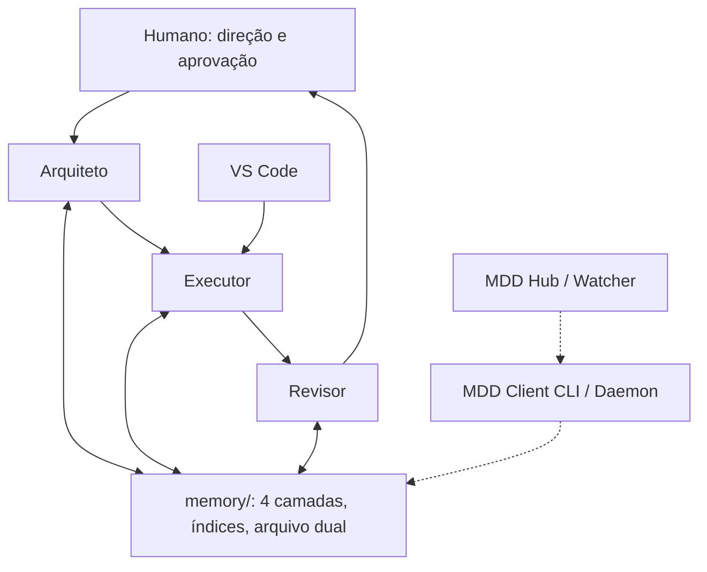

# Conn2Flow AI Workspace

### O sistema operacional de Memory-Driven Development para engenharia multiagente

[English](README.md) · [Documentação](docs/pt-br/README.md)

   

Projetos longos com IA perdem contexto entre sessões. **Memory-Driven Development (MDD)** mantém especificações, decisões, evidências de execução e procedimentos reutilizáveis no Git para que o próximo agente retome o trabalho por um índice pequeno e fontes verificadas.

Este workspace oferece a fundação da **Tríade Arquiteto–Executor–Revisor**, **44 skills canônicas**, um painel VS Code e uma ponte MCP. Seu roteiro Python acrescenta o **MDD Client CLI/Daemon** para memória local e o **MDD Hub** para relatórios e monitoramento de documentação. A abordagem de memória serve a qualquer projeto; as skills específicas do Conn2Flow apoiam seu ecossistema PHP e de recursos.

## Como as partes se conectam

```mermaid
flowchart TB
  H["Humano: direção e aprovação"] --> A["Arquiteto"]
  A --> E["Executor"]
  E --> R["Revisor"]
  R --> H
  A <--> M["memory/: 4 camadas, índices, arquivo dual"]
  E <--> M
  R <--> M
  V["VS Code"] --> E
  C["MDD Client CLI / Daemon"] -.-> M
  U["MDD Hub / Watcher"] -.-> C
```

Quatro camadas separam episódios, conhecimento aprovado, procedimentos e observações raw. Índices hierárquicos orientam a consulta; arquivos duais preservam uma síntese concisa e a evidência original.

Conexões contínuas descrevem o fluxo atual; conexões pontilhadas mostram os componentes Python aprovados para desenvolvimento. Neste checkout, seus pacotes ainda não estão presentes. Consulte a disponibilidade no [guia Python](docs/pt-br/GUIA-ECOSSISTEMA-PYTHON-MDD.md).

## Quickstart em três passos

1. **Abra o workspace.** Clone este repositório, abra no VS Code e instale um VSIX compilado do Conn2Flow Dev Tools por **Extensões → Instalar do VSIX**. O [guia do painel](docs/pt-br/GUIA-PAINEL-DEV-TOOLS-VSCODE.md) explica os controles. A alternativa Python, quando o Client estiver disponível, é `mdd init ./my-project --type software` (Python 3.11+).
2. **Selecione o trabalho.** Nos Controles Principais, selecione o escopo do repositório, a topologia tríade e a autonomia. Abra `memory/human-requests/CURRENT.md`, siga a requisição aprovada e leia o `index.md` pertinente antes dos documentos densos. Novos usuários começam pelo [guia do framework](docs/pt-br/ESPECIFICACAO-FRAMEWORK-MDD.md) e pelo [fluxo dos agentes](docs/pt-br/PLAYBOOK-ORQUESTRACAO-MULTI-AGENTES.md).
3. **Mantenha os procedimentos alinhados.** Na raiz desta matriz, audite as skills com `node scripts/skills/sync-skills.cjs`; mantenedores aplicam as skills selecionadas pelo mesmo sincronizador. O equivalente previsto no Client é `mdd sync`. Inicie o slice aprovado, mostre a Live Todo List e registre verificações antes da revisão.

## Explore a documentação

| Guia | Conteúdo |
| --- | --- |
| [Mecânica de memória e retenção](docs/pt-br/ESPECIFICACAO-FRAMEWORK-MDD.md) | Quatro camadas, 10 ativos, 50 KB e arquivos. |
| [Client e Hub em Python](docs/pt-br/GUIA-ECOSSISTEMA-PYTHON-MDD.md) | Comandos previstos e modos de evolução. |
| [Arquiteto, Executor, Revisor](docs/pt-br/ARQUITETURA-AGENTE-DUPLO.md) | Responsabilidades e revisão independente. |
| [44 skills canônicas](docs/pt-br/CATALOGO-DE-SKILLS.md) | Quando carregar cada procedimento. |
| [CLI Core e MCP](docs/pt-br/GUIA-RAPIDO-CLI-E-MCP.md) | Ferramentas disponíveis e configuração. |
| [Painel VS Code](docs/pt-br/GUIA-PAINEL-DEV-TOOLS-VSCODE.md) | Controles, choques e integração dual prevista. |
| [Fluxo multiagente](docs/pt-br/PLAYBOOK-ORQUESTRACAO-MULTI-AGENTES.md) | Do briefing ao recibo verificável. |
| [Roteiro e estado das entregas](docs/pt-br/ROTEIRO-EVOLUCAO-FUTURA.md) | Implementado, aprovado e incubado. |
| [Empacotamento e publicação da extensão](docs/pt-br/GUIA-PUBLICACAO-VSCODE-MARKETPLACE.md) | Manifesto, pacote e verificações locais. |

## O que está disponível

A matriz já usa `memory/`, a política de quatro camadas, arquivos duais, 44 skills, o MCP Hub TypeScript e o painel VS Code. O manifesto da extensão indica **1.1.1**; **v1.1.2** é o alvo de release. A implementação Python do Client/Hub foi aprovada separadamente, e sua integração dual ao VS Code continua planejada. Instaladores existentes e descoberta dos satélites ainda suportam o legado `sdd/`; a migração é uma frente separada.

Confira comportamentos no código e na configuração vigente. A documentação distingue implementação de intenção; uma memória antiga nunca prevalece sobre a fonte atual. Consulte a [LICENSE](LICENSE).

## Sugestão de descrição e tópicos para o GitHub

**Descrição:** Memory-Driven Development para engenharia multiagente: memória persistente de projeto, 44 skills, painel VS Code e roteiro de ferramentas Python.

**Tópicos:** `memory-driven-development`, `multi-agent`, `ai-engineering`, `agent-skills`, `mcp`, `vscode-extension`, `python`, `developer-tools`, `conn2flow`.
