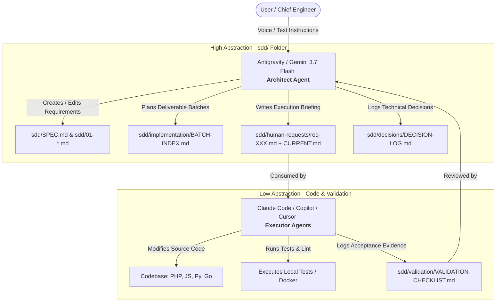

<p align="right">
  <strong>English</strong> • <a href="README-PT-BR.md">Português (Brasil)</a>
</p>

# Conn2Flow AI Workspace: Double Agent SDD Framework 🚀

Welcome to the **Conn2Flow AI Workspace**! This repository centralizes cutting-edge templates, configurations, and documentation to implement the **Spec-Driven Development (SDD)** methodology using a **Double Agent + Human-in-the-Loop** ecosystem.

This framework is open-source, modular, and designed to be injected into **any software repository** (regardless of language or stack) to drastically accelerate engineering velocity using AI while keeping absolute architectural control.


---

## 💡 The Concept: The Double Agent Model

Letting an AI write code in isolation often leads to unnecessary refactoring, silent regressions, and a loss of high-level system alignment. This workspace solves this issue by dividing AI duties into two distinct, complementary roles operating over a single, local source of truth (`sdd/`):



1. **The Architect (Macro-Orchestrator - Antigravity / Gemini 3.7 Flash)**:
   - Focuses on the high level. Translates informal human requests (transcribed voice notes, loose messages) into structured technical requirements.
   - Manages the system specifications (`sdd/SPEC.md`), logs architectural decisions, and writes the execution briefs in `sdd/human-requests/`.
   - **Gold Rule**: Never commits or pushes changes directly. Modifications remain unstaged/working tree for easy visual diff review by the human engineer.
2. **The Executor (Micro-Operator - Claude Code / Copilot / Cursor)**:
   - Focuses on the low level. Reads the briefing and specifications generated by the Architect.
   - Modifies the codebase, resolves lint errors, runs local tests, and registers validation evidence.
3. **The Human-in-the-Loop (You)**:
   - Directs the Architect and inspects the code diff generated by the Executor in the Git panel before staging and committing.

---

## 📂 Semantic Workspace Structure

This repository is organized into clean domain-specific folders with full bilingual support (`en` and `pt-br`):

* **`templates/`** (`en/` and `pt-br/`):
  - `sdd-boilerplate/`: Canonical initial skeleton of the `sdd/` directory for new projects.
  - `templates/spec-driven-project-claude-kit`: Rules, subagents, and on-demand commands for **Claude Code** in SDD projects.
  - `templates/spec-driven-project-copilot-kit`: Prompts, system instructions, and agents for **GitHub Copilot** in SDD projects.
  - `templates/spec-driven-project-cursor-kit`: Project rules (`.cursor/rules/sdd.mdc`), legacy compatibility (`.cursorrules`), and skills for **Cursor IDE**.
  - `templates/spec-driven-project-gemini-kit`: `GEMINI.md`, Gemini CLI configuration (`.gemini/settings.json`), native skills (`.gemini/skills/`), `.geminiignore`, and `.aiexclude` compatibility.
  - `templates/spec-driven-project-codex-kit`: `CODEX.md`, `AGENTS.md`, OpenAI Codex/GPT configuration (`.codex/settings.json`), and native skills (`.codex/skills/`).
  - `templates/private-project-claude-kit`: Claude Code setup for private repositories extending a core repo.
  - `templates/private-project-copilot-kit`: GitHub Copilot setup for private repositories extending a core repo.
* **`docs/`** (`en/` and `pt-br/`): Comprehensive technical manuals, skills catalog, multi-agent playbook, and CLI/MCP guide.
* **`scripts/`**: Automation scripts in PowerShell (`.ps1`) and Bash (`.sh`) to instantly install kits into any target repository.
* **`mcp-hub/`**: Dockerized MCP Server enabling intelligent inter-agent communication and task dispatch across IDEs and models.
* **`sdd/`**: Living Spec-Driven Development governance that manages this AI Workspace repository itself.

---

## 🛠️ Installation & Getting Started

To inject this framework into your project, open your terminal in the workspace root and run the commands matching your environment.

### 1. Claude Code (Recommended)
To inject SDD controls and Claude Code settings into your project:
- **Windows (PowerShell)**:
  ```powershell
  scripts/install-spec-driven-claude-kit.ps1 -TargetRepoPath "C:/path/to/your-repo" -AgentPrefix "yourproject" -Language "en"
  ```
- **Linux / macOS (Bash)**:
  ```bash
  scripts/install-spec-driven-claude-kit.sh /path/to/your-repo --agent-prefix yourproject --language en
  ```

### 2. GitHub Copilot
To inject Copilot system instructions, agent chats, and prompt templates:
- **Windows (PowerShell)**:
  ```powershell
  scripts/install-spec-driven-copilot-kit.ps1 -TargetRepoPath "C:/path/to/your-repo" -AgentPrefix "yourproject" -Language "en"
  ```
- **Linux / macOS (Bash)**:
  ```bash
  scripts/install-spec-driven-copilot-kit.sh /path/to/your-repo --agent-prefix yourproject --language en
  ```

### 3. Cursor IDE
To inject the primary MDC rule (`.cursor/rules/sdd.mdc`), on-demand skills (`.cursor/skills/`), and the legacy-compatible `.cursorrules` file:
- **Windows (PowerShell)**:
  ```powershell
  scripts/install-spec-driven-cursor-kit.ps1 -TargetRepoPath "C:/path/to/your-repo" -AgentPrefix "yourproject" -Language "en"
  ```
- **Linux / macOS (Bash)**:
  ```bash
  scripts/install-spec-driven-cursor-kit.sh /path/to/your-repo --agent-prefix yourproject --language en
  ```

### 4. Antigravity / Gemini 3.7 Flash
To inject Gemini system instructions (`GEMINI.md`), project settings (`.gemini/settings.json`), native on-demand skills (`.gemini/skills/`), style guide, `.geminiignore`, and `.aiexclude` compatibility:
- **Windows (PowerShell)**:
  ```powershell
  scripts/install-spec-driven-gemini-kit.ps1 -TargetRepoPath "C:/path/to/your-repo" -AgentPrefix "yourproject" -Language "en"
  ```
- **Linux / macOS (Bash)**:
  ```bash
  scripts/install-spec-driven-gemini-kit.sh /path/to/your-repo --agent-prefix yourproject --language en
  ```

### 5. OpenAI Codex / GPT (VS Code)
To inject OpenAI Codex instructions (`CODEX.md`, `AGENTS.md`), project settings (`.codex/settings.json`), and native on-demand skills (`.codex/skills/`):
- **Windows (PowerShell)**:
  ```powershell
  scripts/install-spec-driven-codex-kit.ps1 -TargetRepoPath "C:/path/to/your-repo" -AgentPrefix "yourproject" -Language "en"
  ```
- **Linux / macOS (Bash)**:
  ```bash
  scripts/install-spec-driven-codex-kit.sh /path/to/your-repo --agent-prefix yourproject --language en
  ```

*Note: The `-AgentPrefix` parameter is optional and renames the default subagents (e.g. `yourproject-sdd-coordinator`). The `-Language` (or `--language`) parameter switches between `en` (English) and `pt-br` (Portuguese, default).*

---

## 🚦 The Ping-Pong Boundaries (Writing Rules)

To prevent the executor from rewriting specs or making unauthorized design decisions, the system instructions inside the kits define a strict boundary:

* 🟢 **Operational Area (Executor Writable)**: The Executor is free to update implementation lists in `sdd/implementation/` and validation/test logs in `sdd/validation/`.
* 🟡 **Request Intake Area (Shared Writable with Atomic Reservation)**: Any agent (Architect or Executor) is authorized to create new `sdd/human-requests/req-XXX.md` files upon human instruction or technical discovery, strictly adhering to the **Atomic Reservation Protocol** (`git pull`, atomic sequential number check, immediate commit/push of `req-XXX.md` and `CURRENT.md`).
* 🔴 **Normative Area (Executor Read-Only)**: The Executor is strictly forbidden from editing numbered specifications (`sdd/SPEC.md`, `sdd/0X-*.md`) or decisions (`sdd/decisions/DECISION-LOG.md`). If the executor finds a spec discrepancy, it must flag it to the user so the Architect IA can draft a Change Request (`CR-XXX.md`).

---

## 🧠 Engineering Memories (Chief & Execution)

To prevent context loss and eliminate the need for repetitive guidance across AI agent sessions, the Double Agent SDD Framework introduces two optional engineering diaries:
*   **Chief Engineer Memory (`MEMORIA-ENGENHARIA-CHEFIA.md` / `ENGINEERING-MEMORY-CHIEF.md`)**: Read-only for the AI Executor. Contains style guidelines, coding conventions, architectural boundaries, and business constraints dictated by the Human Chief Engineer.
*   **Execution Memory (`MEMORIA-ENGENHARIA-EXECUCAO.md` / `ENGINEERING-MEMORY-EXECUTION.md`)**: Read-write for the AI Executor. The Executor records local dependency notes, compiler quirks, database workarounds, and resolved bugs here at the end of each session.

AI instructions in the kits automatically prompt the agent to:
1.  **Read memories** at the start of a session to align context.
2.  **Append lessons learned** and environment details to the Execution Memory when closing a task.
3.  **Respect the boundary** of the Chief Engineer Memory, never altering it without direct human command.

---

## 🌾 Memory Gardening & Skill Harvesting

As projects evolve, execution memories can grow large (~100 KB+), consuming unnecessary prompt tokens upon session start. The framework implements **Memory Gardening**:
*   **Idempotent Pruning Thresholds**:
    - **Preventive Attention Trigger**: Fired at **35 KB / ~100 lines**.
    - **Mandatory Pruning Ceiling**: Strictly required when reaching **50 KB / ~150 lines**.
    - **Post-Pruning Target**: Reduces active memory file to **~15 KB** (retaining the **12 to 15 most recent tasks**).
*   **Skill Harvesting**: Extracted patterns are distilled into reusable, on-demand **Skills**:
    - **Core Skills**: Kept in `conn2flow-ai-workspace` for general framework patterns (e.g. `c2f-json-resources-sync`, `c2f-widget-development`, `c2f-tailwind-css-architecture`).
    - **Project Skills**: Kept in `.claude/skills/`, `.cursor/skills/`, `.github/skills/`, `.gemini/skills/`, and `.codex/skills/` for repository-specific, dynamically loaded rules (e.g. `lumix-tailwind-v4`, `transformamp-wp-etl`).
*   **Token Efficiency**: Keeps prompt context fast and cost-effective, saving up to 80% of bootstrap tokens while preserving essential recent history.

---

## 🛠️ Conn2Flow Core Skills Catalog (27 Engineering Skills)

The workspace centralizes a complete catalog of **27 Conn2Flow Core Skills** (`c2f-*`) + **7 SDD Workflow Skills** (**34 Skills total**), automatically injected into all project kits (`.claude/skills/`, `.cursor/skills/`, `.github/skills/`, `.gemini/skills/`, and `.codex/skills/`) to equip any AI agent with native technical intelligence about the ecosystem:

1. **Resources, Variables & Frontend**:
   - `c2f-resources-system`: Source compilation architecture for 11 resource types (`resources/`) to `*Data.json`, declarative SQL sync, and mandatory Version Bump rule.
   - `c2f-variables-system`: **[NEW]** Multi-language i18n, system alerts/warnings, and UI labels governance via `variables.json`. Prohibits hardcoded strings in PHP/HTML/JS.
   - `c2f-html-css-pages-and-components`: Mandatory rule prohibiting loose static `.html`, `.css`, and `.md` files outside `resources/`.
   - `c2f-tailwind-css-architecture`: Tailwind CSS v4 governance for responsive cascade, `css_compiled`, dynamic templates, and builds through `c2f resources:sync`.
   - `c2f-modelo-templates`: HTML template parsing and repeating cells (`modelo_var_troca`, `<!-- cel < -->`, `modelo_var_in`).
   - `c2f-javascript-ajax`: Canonical Gestor AJAX integration contract (Vanilla Fetch, `URLSearchParams`, `FormData`), CSRF 403 prevention (`ajax: 'sim'`), PHP lifecycle, and Version Bump rule.
   - `c2f-multilingual-system`: Hybrid i18n system (`pt-br`, `en`, `es`), `language` natural key, and physical directories.
   - `c2f-preview-modals-system`: Dynamic component and layout preview modals in the manager.
   - `c2f-widget-development`: Widget development pattern and system injection.

2. **Modules, Backend & Database**:
   - `c2f-module-crud-scaffolding`: **[NEW]** Canonical CRUD module scaffolding pattern based on the live architecture of `modulos-grupos`.
   - `c2f-environment-configuration`: **[NEW]** Governance for sensitive credentials and `.env` templates via `config.php` and `$_CONFIG`.
   - `c2f-gestor-functions`: Core functions of `gestor.php` (`gestor_componente`, `gestor_variaveis`, `gestor_redirecionar`, layouts, and sessions).
   - `c2f-global-variables`: Map of superglobals `$_GESTOR` (runtime), `$_CONFIG` (system), `$_BANCO` (connection), and `$_ENV` (infra).
   - `c2f-database-operations`: CRUD via `banco.php` (`banco_select_name`, `banco_update`) and Phinx Migration structure.
   - `c2f-database-testing`: Automated database testing and SQLite test harness.
   - `c2f-hooks-system`: Actions (`hook_do_action`) vs. Filters (`hook_apply_filters`), JSON registration, and controllers.
   - `c2f-interface-v2-architecture`: V2 Administrative CRUD screen builder using `interface.php`.
   - `c2f-json-resources-sync` & `c2f-mysql-utf8-emoji-encoding`: UTF-8mb4 encoding and JSON metadata synchronization.

3. **Projects, Plugins & Automation**:
   - `c2f-agent-visual-inspection`: **[NEW]** Autonomous visual and runtime inspection in local Docker environment (`c2f page:inspect`, `c2f auth:cookie`).
   - `c2f-projects-system`: Private project deployment pipeline via OAuth API (`/api/project/update`), ZIP, and inline execution.
   - `c2f-plugin-architecture`: Manifest `plugin.json`, scoping, and lifecycle (`_install`/`_uninstall`) for public and private plugins.
   - `c2f-system-tasks`: System automation tasks hub (`.vscode/tasks.json`) for Docker, builds, and deploys.
   - `c2f-dev-scripts`: Conventions for creating and using CLI/Bash/PHP scripts in `ai-workspace/scripts/`.
   - `c2f-docker-environment`: Log inspection `/var/log/php_errors.log` and CLI execution in the `conn2flow-app` container.
   - `c2f-gd-image-safety`: Safe image manipulation using GD library.

4. **Documentation Governance**:
   - `c2f-documentation-governance`: Establishes the **Principle of Source Code Authority** over documentation, instructing agents to audit live `.php`/`.js` source files and prevent doc drift.

---

## ⚡ Quickstart Guide: Core CLI (`c2f`), MCP Hub & Worktrees

The framework provides a cross-platform automation suite out of the box:

### 1. Core CLI (`c2f`) in the Terminal:
* **Git Bash / Linux / macOS**: `./c2f <command>` (e.g. `./c2f resources:sync`, `./c2f ai:sync`, `./c2f module:create <id>`)
* **Windows PowerShell**: `.\c2f.ps1 <command>`
* **Windows CMD**: `c2f <command>`

### 2. Dual-Mode MCP Hub Server (Docker with Auto-Start):
```bash
cd mcp-hub
docker compose up -d --build
```
*Enables Antigravity, Claude Code, and Cursor to communicate and execute tasks in Supervised (Chat UI) or Headless (Background) modes.*

### 3. Git Worktrees for Parallel Agents:
```powershell
.\scripts\git\create-agent-worktree.ps1 -RepoPath "C:\path\to\conn2flow" -BranchName "feat-new-module"
```

---

## 📚 Technical Documentation Hub (`docs/`)

For in-depth technical guides, explore the dedicated documentation in `docs/en/`:
* 🚀 [Core CLI, MCP Hub & Worktrees Quickstart](docs/en/QUICKSTART-CLI-AND-MCP.md) — Complete tutorial and command reference.
* 🧭 [Multi-Agent & IDE Orchestration Playbook](docs/en/MULTI-AGENT-ORCHESTRATION-PLAYBOOK.md) — Seamlessly switch between Claude, Cursor, Copilot, and Antigravity.
* 🏛️ [Double Agent Architecture](docs/en/DOUBLE-AGENT-ARCHITECTURE.md) — Role separation, writing boundaries, and governance.
* 🧩 [Complete Skills Catalog](docs/en/SKILLS-CATALOG.md) — Exhaustive guide for all 34 skills with contracts.
* 🔮 [Future Evolution Roadmap](docs/en/FUTURE-EVOLUTION-ROADMAP.md) — MCP Servers, self-healing CI/CD, and educational framework.

👉 *Looking for Brazilian Portuguese documentation? Check the [Portuguese Documentation Hub](docs/pt-br/README.md).*


---

## 🧹 Context Optimization & SDD Archiving

To prevent agent attention degradation due to prompt bloat and keep token usage highly cost-efficient, the framework implements an active size limit:
*   **25-Item Active Cap**: Core tracking files like `DECISION-LOG.md`, `BATCH-INDEX.md`, and `VALIDATION-CHECKLIST.md` maintain the **25 most recent active items** (with a 35 KB to 50 KB ceiling), preserving valuable history and eliminating frequent pruning cycles.
*   **Archive Folder Structure**: Older entries are relocated to an `/archive/` subfolder in their respective directories (e.g., `sdd/decisions/archive/`, `sdd/implementation/archive/`, etc.).
*   **Automatic Upgrades**: The installer scripts (`scripts/install-spec-driven-*.ps1` / `.sh`) detect pre-existing `sdd/` folders and safely provision these archive directories with standard `README.md` explanation sheets, upgrading legacy projects automatically without altering existing configurations.


---

## 🧊 Idea Backlog & Intake Gate

The optional `sdd/backlog/` module incubates long-term Features, Epics, Spikes/Research, and Architecture proposals under three states: `ICEBOX`, `IN-DISCUSSION`, and `READY`.

Backlog items are never executable by themselves. Executors may read them for context, but implementation is prohibited until the User explicitly promotes an item into `sdd/human-requests/`, updates `CURRENT.md`, and assigns an executable batch. Installers provision this structure non-destructively in existing SDD projects.

---

## ⚖️ License

This project is released under the MIT License. Feel free to use, modify, and distribute it inside your company or community.
