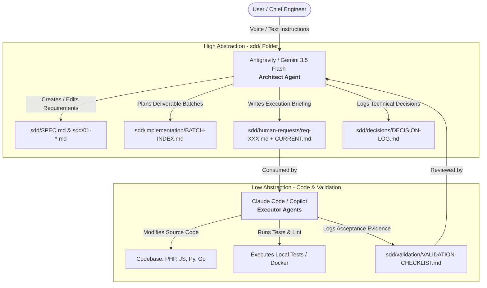

# Conn2Flow AI Workspace: Double Agent SDD Framework 🚀

Welcome to the **Conn2Flow AI Workspace**! This repository centralizes cutting-edge templates, configurations, and documentation to implement the **Spec-Driven Development (SDD)** methodology using a **Double Agent + Human-in-the-Loop** ecosystem.

This framework is open-source, modular, and designed to be injected into **any software repository** (regardless of language or stack) to drastically accelerate engineering velocity using AI while keeping absolute architectural control.

---

## 💡 The Concept: The Double Agent Model

Letting an AI write code in isolation often leads to unnecessary refactoring, silent regressions, and a loss of high-level system alignment. This workspace solves this issue by dividing AI duties into two distinct, complementary roles operating over a single, local source of truth (`sdd/`):



1. **The Architect (Macro-Orchestrator - Antigravity / Gemini)**:
   - Focuses on the high level. Translates informal human requests (transcribed voice notes, loose messages) into structured technical requirements.
   - Manages the system specifications (`sdd/SPEC.md`), logs architectural decisions, and writes the execution briefs in `sdd/human-requests/`.
   - **Gold Rule**: Never commits or pushes changes directly. Modifications remain unstaged/working tree for easy visual diff review by the human engineer.
2. **The Executor (Micro-Operator - Claude Code / Copilot)**:
   - Focuses on the low level. Reads the briefing and specifications generated by the Architect.
   - Modifies the codebase, resolves lint errors, runs local tests, and registers validation evidence.
3. **The Human-in-the-Loop (You)**:
   - Directs the Architect and inspects the code diff generated by the Executor in the Git panel before staging and committing.

---

## 📂 Workspace Directory Structure

This repository organizes AI kits in both English (`en`) and Portuguese (`pt-br`):

* **`en/`** & **`pt-br/`**:
  - `sdd-boilerplate/`: The clean skeleton of the `sdd/` directory governing your project.
  - `templates/spec-driven-project-claude-kit`: Rules, subagents, and on-demand commands to run **Claude Code** in SDD projects.
  - `templates/spec-driven-project-copilot-kit`: Prompts, system instructions, and agents to run **GitHub Copilot** in SDD projects.
  - `templates/spec-driven-project-cursor-kit`: Project rules (`.cursor/rules/sdd.mdc`), legacy compatibility (`.cursorrules`), and on-demand skills (`.cursor/skills/`) for **Cursor IDE** in SDD projects.
  - `templates/spec-driven-project-gemini-kit`: System instructions (`GEMINI.md`, `.gemini/`, `.aiexclude`) to run **Antigravity / Gemini Pro** in SDD projects.
  - `templates/private-project-claude-kit`: Claude Code setup for private repositories extending a core repo.
  - `templates/private-project-copilot-kit`: GitHub Copilot setup for private repositories extending a core repo.
* **`scripts/`**: Automation scripts in PowerShell (`.ps1`) and Bash (`.sh`) to instantly install the kits into any target repository on your computer, with language selection support.

---

## 🛠️ Installation & Getting Started

To inject this framework into your project, open your terminal in the workspace root and run the commands matching your environment.

### 1. Claude Code (Recommended)
To inject SDD controls and Claude Code settings into your project:
- **Windows (PowerShell)**:
  ```powershell
  scripts/install-spec-driven-claude-kit.ps1 -TargetRepoPath "C:/path/to/your-repo" -AgentPrefix "yourproject" -Language "en"
  ```
- **Linux / macOS (Bash)**:
  ```bash
  scripts/install-spec-driven-claude-kit.sh /path/to/your-repo --agent-prefix yourproject --language en
  ```

### 2. GitHub Copilot
To inject Copilot system instructions, agent chats, and prompt templates:
- **Windows (PowerShell)**:
  ```powershell
  scripts/install-spec-driven-copilot-kit.ps1 -TargetRepoPath "C:/path/to/your-repo" -AgentPrefix "yourproject" -Language "en"
  ```
- **Linux / macOS (Bash)**:
  ```bash
  scripts/install-spec-driven-copilot-kit.sh /path/to/your-repo --agent-prefix yourproject --language en
  ```

### 3. Cursor IDE
To inject the primary MDC rule (`.cursor/rules/sdd.mdc`), on-demand skills (`.cursor/skills/`), and the legacy-compatible `.cursorrules` file:
- **Windows (PowerShell)**:
  ```powershell
  scripts/install-spec-driven-cursor-kit.ps1 -TargetRepoPath "C:/path/to/your-repo" -AgentPrefix "yourproject" -Language "en"
  ```
- **Linux / macOS (Bash)**:
  ```bash
  scripts/install-spec-driven-cursor-kit.sh /path/to/your-repo --agent-prefix yourproject --language en
  ```

### 4. Antigravity / Gemini Pro
To inject Gemini system instructions (`GEMINI.md`, `.gemini/config.yaml`, `.gemini/styleguide.md`, `.aiexclude`):
- **Windows (PowerShell)**:
  ```powershell
  scripts/install-spec-driven-gemini-kit.ps1 -TargetRepoPath "C:/path/to/your-repo" -AgentPrefix "yourproject" -Language "en"
  ```
- **Linux / macOS (Bash)**:
  ```bash
  scripts/install-spec-driven-gemini-kit.sh /path/to/your-repo --agent-prefix yourproject --language en
  ```

*Note: The `-AgentPrefix` parameter is optional and renames the default subagents (e.g. `yourproject-sdd-coordinator`). The `-Language` (or `--language`) parameter switches between `en` (English) and `pt-br` (Portuguese, default).*

---

## 🚦 The Ping-Pong Boundaries (Writing Rules)

To prevent the executor from rewriting specs or making unauthorized design decisions, the system instructions inside the kits define a strict boundary:

* 🟢 **Operational Area (Executor Writable)**: The Executor is free to update implementation lists in `sdd/implementation/` and validation/test logs in `sdd/validation/`.
* 🔴 **Normative Area (Executor Read-Only)**: The Executor is strictly forbidden from editing numbered specifications (`sdd/SPEC.md`, `sdd/0X-*.md`) or decisions (`sdd/decisions/DECISION-LOG.md`). If the executor finds a spec discrepancy, it must flag it to the user so the Architect IA can draft a Change Request (`CR-XXX.md`).

---

## 🧠 Engineering Memories (Chefia & Execução)

To prevent context loss and eliminate the need for repetitive guidance across AI agent sessions, the Double Agent SDD Framework introduces two optional engineering diaries:
*   **Chief Engineer Memory (`MEMORIA-ENGENHARIA-CHEFIA.md` / `ENGINEERING-MEMORY-CHIEF.md`)**: Read-only for the AI Executor. Contains style guidelines, coding conventions, architectural boundaries, and business constraints dictated by the Human Chief Engineer.
*   **Execution Memory (`MEMORIA-ENGENHARIA-EXECUCAO.md` / `ENGINEERING-MEMORY-EXECUTION.md`)**: Read-write for the AI Executor. The Executor records local dependency notes, compiler quirks, database workarounds, and resolved bugs here at the end of each session.

AI instructions in the kits automatically prompt the agent to:
1.  **Read memories** at the start of a session to align context.
2.  **Append lessons learned** and environment details to the Execution Memory when closing a task.
3.  **Respect the boundary** of the Chief Engineer Memory, never altering it without direct human command.

---

## 🌾 Memory Gardening & Skill Harvesting

As projects evolve, execution memories can grow large (~100 KB+), consuming unnecessary prompt tokens upon session start. The framework implements **Memory Gardening**:
*   **Pruning Threshold**: When an execution memory exceeds ~15 KB or ~50 lines, recurring lessons are extracted and pruned.
*   **Skill Harvesting**: Extracted patterns are distilled into reusable, on-demand **Skills**:
    - **Core Skills**: Kept in `conn2flow-ai-workspace` for general framework patterns (e.g. `c2f-json-resources-sync`, `c2f-widget-development`, `c2f-mysql-utf8-emoji-encoding`).
    - **Project Skills**: Kept in `.claude/skills/` and `.cursor/skills/` for repository-specific, dynamically loaded rules (e.g. `lumix-tailwind-v4`, `transformamp-wp-etl`).
*   **Token Efficiency**: Pruning reduces active memory files to ~5 KB (keeping only 3–5 recent tasks), saving up to 90% of initial prompt context tokens while retaining deep knowledge on demand.

---

## 🧹 Context Optimization & SDD Archiving

To prevent agent attention degradation due to prompt bloat and keep token usage highly cost-efficient, the framework implements an active size limit:
*   **10-Item Cap**: Core tracking files like `DECISION-LOG.md`, `BATCH-INDEX.md`, and `VALIDATION-CHECKLIST.md` are limited to the **10 most recent active items**.
*   **Archive Folder Structure**: Older entries are relocated to an `/archive/` subfolder in their respective directories (e.g., `sdd/decisions/archive/`, `sdd/implementation/archive/`, etc.).
*   **Automatic Upgrades**: The installer scripts (`scripts/install-spec-driven-*.ps1` / `.sh`) detect pre-existing `sdd/` folders and safely provision these archive directories with standard `README.md` explanation sheets, upgrading legacy projects automatically without altering existing configurations.

---

## ⚖️ License

This project is released under the MIT License. Feel free to use, modify, and distribute it inside your company or community.
