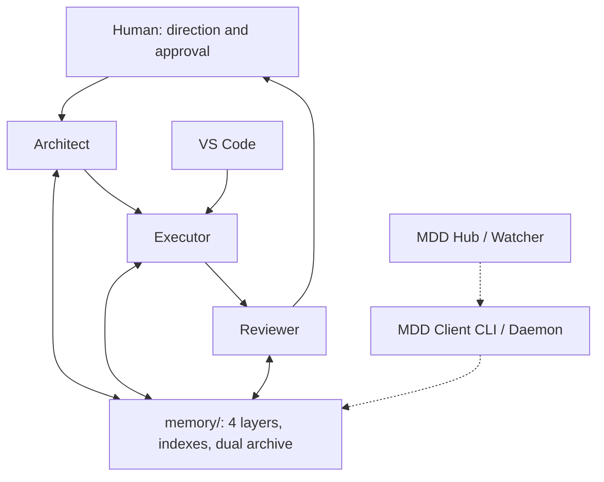

# Conn2Flow AI Workspace

### The Memory-Driven Development operating system for multi-agent engineering

[Português](README-PT-BR.md) · [Documentation](docs/en/README.md)

   

Long-running AI projects lose context between sessions. **Memory-Driven Development (MDD)** keeps specifications, decisions, execution evidence and reusable procedures in Git so the next agent can resume from a small index and verified sources.

This workspace provides the foundation for an **Architect–Executor–Reviewer triad**, **45 canonical skills**, a VS Code panel and an MCP bridge. Its Python roadmap adds the **MDD Client CLI/Daemon** for local memory and the **MDD Hub** for reports and documentation monitoring. The memory approach can serve any project; Conn2Flow-specific skills support its PHP and resource ecosystem.

## How it fits together

```mermaid
flowchart TB
  H["Human: direction and approval"] --> A["Architect"]
  A --> E["Executor"]
  E --> R["Reviewer"]
  R --> H
  A <--> M["memory/: 4 layers, indexes, dual archive"]
  E <--> M
  R <--> M
  V["VS Code"] --> E
  C["MDD Client CLI / Daemon"] -.-> M
  U["MDD Hub / Watcher"] -.-> C
```

Four layers separate episodes, approved knowledge, procedures and raw observations. Hierarchical indexes guide retrieval; dual archives preserve both a concise summary and the original evidence.

Solid connections describe the current workflow; dotted connections show the Python components approved for development. At this checkout, their packages are not yet present. See the [Python guide](docs/en/MDD-PYTHON-ECOSYSTEM-GUIDE.md) for availability.

## Quickstart in three steps

1. **Open the workspace.** Clone this repository, open it in VS Code, and install a built Conn2Flow Dev Tools VSIX through **Extensions → Install from VSIX**. The [panel guide](docs/en/VSCODE-DEV-TOOLS-PANEL-GUIDE.md) explains the controls. The Python alternative, once the Client is available, is `mdd init ./my-project --type software` (Python 3.11+).
2. **Select the work.** In Main Controls, select the repository scope, triad topology and autonomy. Open `memory/human-requests/CURRENT.md`, follow the approved request and read the relevant `index.md` before dense documents. New users start with the [framework guide](docs/en/MDD-FRAMEWORK-SPECIFICATION.md) and [agent workflow](docs/en/MULTI-AGENT-ORCHESTRATION-PLAYBOOK.md).
3. **Keep procedures aligned.** From this matrix root, audit skills with `node scripts/skills/sync-skills.cjs`; maintainers apply the selected skills through that same synchronizer. The planned Client equivalent is `mdd sync`. Start the approved slice, show the Live Todo List, and record checks before review.

## Explore the documentation

| Guide | Contents |
| --- | --- |
| [Memory mechanics and retention](docs/en/MDD-FRAMEWORK-SPECIFICATION.md) | Four layers, 10 active items, 50 KB and archives. |
| [Python Client and Hub](docs/en/MDD-PYTHON-ECOSYSTEM-GUIDE.md) | Planned commands and evolution modes. |
| [Architect, Executor, Reviewer](docs/en/DOUBLE-AGENT-ARCHITECTURE.md) | Responsibilities and independent review. |
| [45 canonical skills](docs/en/SKILLS-CATALOG.md) | When to load each procedure. |
| [Core CLI and MCP](docs/en/QUICKSTART-CLI-AND-MCP.md) | Available tools and configuration. |
| [VS Code panel](docs/en/VSCODE-DEV-TOOLS-PANEL-GUIDE.md) | Controls, conflicts and planned dual integration. |
| [Multi-agent workflow](docs/en/MULTI-AGENT-ORCHESTRATION-PLAYBOOK.md) | From briefing to verifiable receipt. |
| [Roadmap and delivery status](docs/en/FUTURE-EVOLUTION-ROADMAP.md) | Implemented, approved and incubated. |
| [Extension packaging and publishing](docs/en/VSCODE-MARKETPLACE-PUBLISHING-GUIDE.md) | Manifest, package and local checks. |

## What is available

The matrix already uses `memory/`, the four-layer policy, dual archives, 45 skills, the TypeScript MCP Hub and the VS Code panel. The extension manifest currently reads **1.1.1**; **v1.1.2** is the release target. Python Client/Hub implementation is approved separately, and their dual VS Code integration remains planned. Existing installers and satellite discovery still support legacy `sdd/`; migration is a separate workstream.

Use the code and current configuration to check behavior. Documentation distinguishes implementation from intent; an old memory entry never overrides current source. See [LICENSE](LICENSE).

## Suggested GitHub description and topics

**Description:** Memory-Driven Development for multi-agent engineering: persistent project memory, 45 skills, a VS Code panel and a Python tooling roadmap.

**Topics:** `memory-driven-development`, `multi-agent`, `ai-engineering`, `agent-skills`, `mcp`, `vscode-extension`, `python`, `developer-tools`, `conn2flow`.
