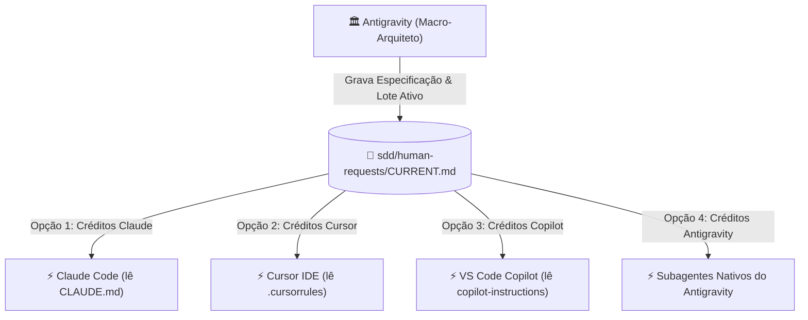

# 🧭 Playbook de Orquestração Multi-Agentes & Alternância entre IDEs

Este playbook prático ensina como operar o **Conn2Flow AI Framework** com múltiplos modelos e ferramentas de IA (**Google Antigravity**, **Claude Code**, **Cursor IDE**, **VS Code GitHub Copilot**), garantindo **portabilidade total (Zero Vendor Lock-in)** e continuidade ininterrupta do trabalho mesmo quando os créditos de uma plataforma acabarem.

---

## 🎯 1. O Princípio da Fonte Única de Verdade (Single Source of Truth)

No Conn2Flow, a inteligência do projeto **não fica presa no histórico de um chat específico**. Ela reside no próprio repositório Git sob a pasta de governança `sdd/`:



---

## 🚀 2. Como Executar Direto no Google Antigravity (Sem Sair do Chat)

Quando você estiver conversando com o **Arquiteto (Antigravity)** e quiser que a tarefa seja executada imediatamente aqui dentro (sem abrir o VS Code nem copiar/colar prompts):

### Como orientar o Arquiteto:
Basta dizer no chat:
> *"Antigravity, execute a requisição atual aqui mesmo usando um subagente com o modelo `pro` (ou `flash`) no modo autônomo monitorado."*

### O que acontece automaticamente:
1. O Arquiteto invoca a ferramenta nativa `invoke_subagent`.
2. O subagente assume o papel de **Engenheiro Executor**, cria a branch/worktree, implementa o código, compila recursos (`c2f resources:sync`) e roda testes (`c2f db:test`).
3. Ao concluir, ele emite o relatório de encerramento na mesma tela.

---

## 🔄 3. Como Alternar entre Ferramentas quando os Créditos Acabarem

Como os kits de IA (`CLAUDE.md`, `.cursorrules`, `.cursor/rules/sdd.mdc`, `GEMINI.md`, `.github/copilot-instructions.md`) e as 32 Skills já estão instalados em todos os repositórios, **a transição entre ferramentas leva menos de 5 segundos**:

---

### 🟣 Cenário A: Executar com Claude Code (CLI / Terminal)
1. Abra o terminal no repositório desejado (ex: `C:\...\conn2flow`).
2. Digite:
   ```bash
   claude
   ```
3. Cole o prompt gerado pelo Arquiteto ou digite apenas:
   > *"Execute a requisição ativa em sdd/human-requests/CURRENT.md no modo autônomo monitorado."*
4. O Claude lê o `CLAUDE.md` e o `CURRENT.md` e inicia a esteira completa.

---

### 🔵 Cenário B: Acabou o crédito no Claude ➔ Mudar para o Cursor IDE
1. Abra a pasta do projeto no **Cursor IDE**.
2. Abra o **Composer** (`Ctrl + I`) ou o Chat (`Ctrl + L`).
3. Digite:
   > *"Execute a requisição ativa em sdd/human-requests/CURRENT.md no modo autônomo monitorado."*
4. O Cursor lê automaticamente o `.cursorrules` e `.cursor/rules/sdd.mdc` e executa a tarefa com o modelo configurado no Cursor (ex: GPT-4o, Sonnet, etc.).

---

### 🟢 Cenário C: Acabou o crédito no Cursor ➔ Mudar para o GitHub Copilot
1. No VS Code, abra o **Copilot Chat** (`Ctrl + Alt + I` ou `@workspace`).
2. Digite:
   > *"Execute a requisição ativa em sdd/human-requests/CURRENT.md no modo autônomo monitorado."*
3. O Copilot lê o `.github/copilot-instructions.md` e executa a tarefa.

---

### 🟡 Cenário D: Acabou tudo fora ➔ Voltar para o Antigravity
1. Abra o chat do Antigravity e diga:
   > *"Acabaram os créditos das IDEs externas. Execute a requisição aqui no Antigravity com subagente."*
2. O Arquiteto despacha a tarefa internamente sem interrupções.

---

## 🎚️ 4. Relembrando o Espectro dos 3 Níveis de Autonomia

Ao disparar qualquer executor, você pode escolher o nível de supervisão:

| Nível | Identificador | Comportamento |
| :--- | :--- | :--- |
| **Nível 1** | `SUPERVISIONADO` | O agente codifica e testa, mas **não faz commit nem deploy** sem revisão prévia de diffs. |
| **Nível 2** | `AUTONOMO_MONITORADO` | O agente executa a esteira completa (código, testes, deploy em testes locais e commit na branch) com **Live Todo List visível na tela em tempo real**. |
| **Nível 3** | `AUTONOMO_HEADLESS` | O agente roda em segundo plano isolado via MCP Hub / Git Worktree sem janelas interativas. |

> [!CAUTION]
> **Regra de Ouro de Segurança**: Em qualquer modo autônomo, o deploy é permitido **EXCLUSIVAMENTE em ambiente de testes local**. É **estritamente proibido** realizar deploy automático em ambiente de produção.
