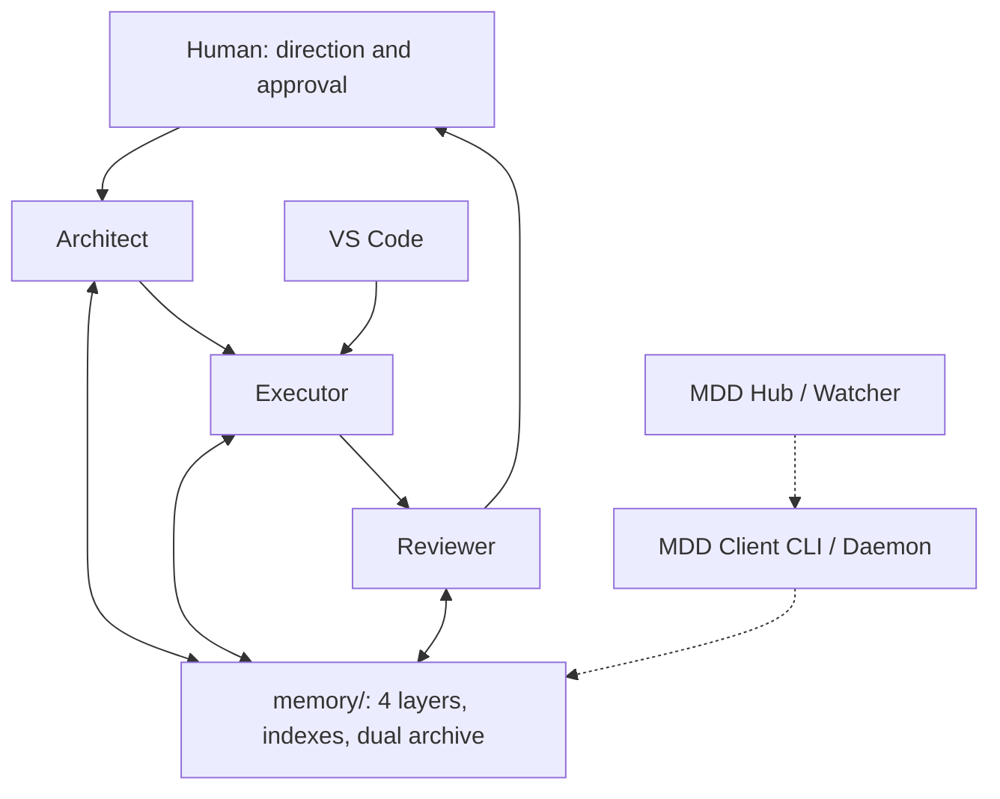

# MDD agent triad architecture

[Português](../pt-br/ARQUITETURA-AGENTE-DUPLO.md) · [Documentation index](README.md)

The historical filename is retained so existing links keep working. MDD extends the original Architect/Executor model with an independent Reviewer and persistent four-layer memory.

## Responsibilities and boundaries

| Role | Required work | Boundary |
| --- | --- | --- |
| Architect | Define approved specifications, decisions, scope, acceptance and autonomy; homologate after review | Does not implement or commit Core/module code |
| Executor | Read CURRENT and the request, show the Live Todo List, implement the approved slice, validate, record batch/checklist evidence and a receipt | Does not invent approval, change contracts outside scope or deploy production implicitly |
| Reviewer | Inspect diffs and current sources, report findings by severity with evidence, issue an independent opinion | Does not claim PASS for checks not run; review does not itself homologate |
| Human | Direct priorities, authorize scope and review consolidation | Retains the approval gate required by the selected workflow |

The role procedures are [Architect](../../.gemini/skills/c2f-architect-master/SKILL.md), [Executor](../../.gemini/skills/c2f-executor-agent/SKILL.md) and [Reviewer](../../.gemini/skills/c2f-reviewer-agent/SKILL.md). The 44-skill [catalog](SKILLS-CATALOG.md) explains task-specific procedures.

## Shared memory and lifecycle

Use the foundation router, CURRENT and the relevant index first. Episodic evidence records execution; semantic memory records approved knowledge; skills provide procedures; raw notes remain non-normative. The [framework specification](MDD-FRAMEWORK-SPECIFICATION.md) explains retention and dual archives.

The operational sequence is **briefing → approved batch → execution and checks → independent review → human/Architect homologation**. Backlog items do not authorize execution until explicitly promoted into an approved request. A contract conflict goes back through change-request governance.

## Topology and autonomy are separate

The panel supports dual and triad topologies. Dual mode combines review with the Architect; the triad assigns a distinct Reviewer. Neither topology changes the approved scope.

| Workflow | CURRENT alias | Current MCP dispatch mode | Meaning |
| --- | --- | --- | --- |
| supervised | supervisionado | supervised | Implement and check; human approves consolidation |
| monitored | autonomo_monitorado | live_autonomous | Progress continuously with a visible Live Todo List and evidence |
| headless | autonomo_headless | headless_autonomous | Authorized background work with receipts and stop conditions |

The planned Python Hub uses headless/monitored/reviewer for documentation evolution. Those names must not be sent unchanged to MCP dispatch_task. Autonomous mode does not authorize production or widen scope.

## Handoffs and consolidation

Every handoff names the project, absolute repository root, REQ, BATCH, current state, evidence and next action. Use memory/ in the matrix; resolve each satellite's actual governance root rather than guessing that migration is complete.

Commit only named files. Resource pipelines run sequentially through official CLI commands; never copy files into test mirrors. The Reviewer reports severity, concrete impact and reproducible evidence before final consolidation. Keep limitations and unexecuted checks visible in the batch report.
