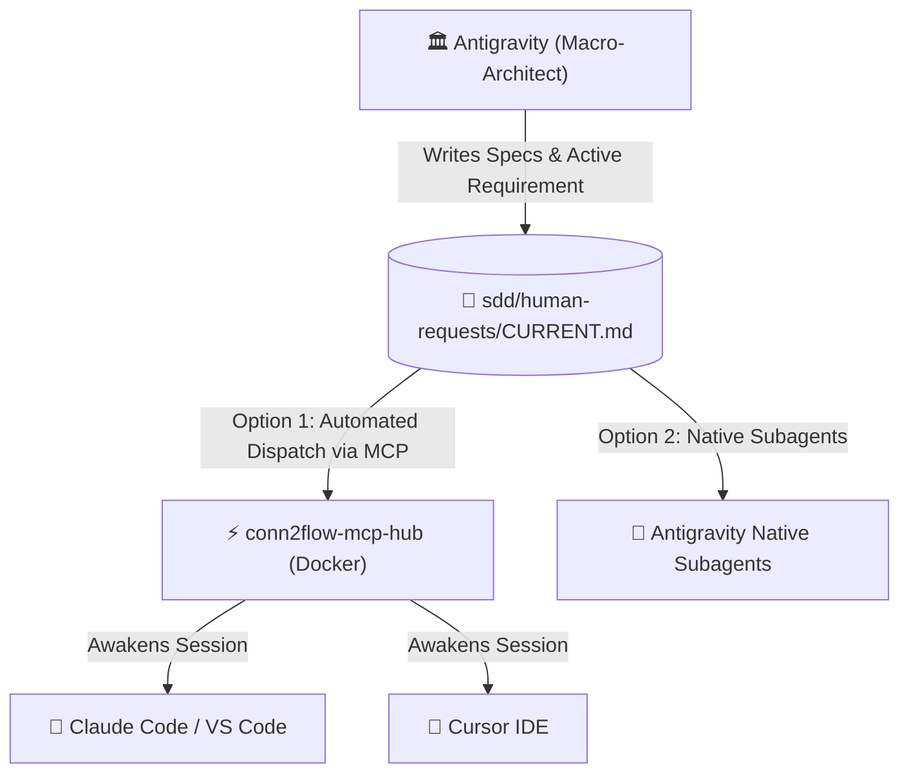
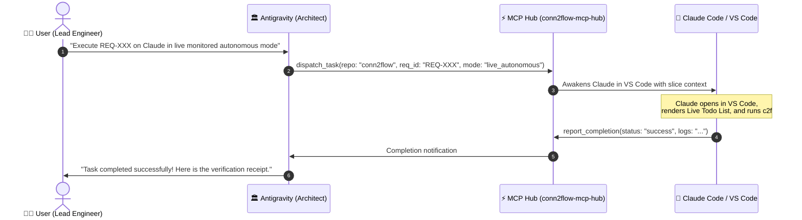

# 🧭 Multi-Agent & IDE Orchestration Playbook

This practical guide teaches how to operate the **Conn2Flow AI Framework** across multiple AI models and tools (**Google Antigravity**, **Claude Code**, **Cursor IDE**, **VS Code GitHub Copilot**, **OpenAI Codex / GPT**), ensuring **zero vendor lock-in** and automated task dispatching via the **MCP Hub**.

---

## 🎯 1. Single Source of Truth Principle

In Conn2Flow, project context **does not live inside ephemeral chat histories**. It is permanently anchored in the Git repository under `sdd/`:



---

## ⚡ 2. Automated MCP Task Dispatching (No Copy-Pasting Required)

With the MCP Hub running, you **never need to manually copy and paste prompts** between tools:



---

## 🚀 3. Direct Execution Inside Google Antigravity (Visible Subagents)

To execute tasks directly within the Antigravity IDE:

### How to prompt the Architect:
> *"Antigravity, execute the active requirement here using a subagent with model `pro` (or `flash`) in live monitored autonomous mode."*

### What happens:
1. The Architect calls `invoke_subagent`.
2. A **dedicated subagent panel/thread opens in the Antigravity interface**.
3. You can click the subagent and **watch live shell commands, file edits, and passing tests in real-time**.
4. Upon completion, the subagent returns the final receipt to the main chat.

---

## 🔄 4. Switching Between Tools when Credits Run Out

To manually switch across external IDEs and terminals:

---

### 🟣 Scenario A: Running with Claude Code (CLI / Terminal)
1. Open the terminal in the target repository (e.g. `C:\...\conn2flow`).
2. Run:
   ```bash
   claude
   ```
3. Type:
   > *"Execute the active requirement in sdd/human-requests/CURRENT.md in live monitored autonomous mode."*
4. Claude automatically reads `CLAUDE.md` and `CURRENT.md` and begins execution.

---

### 🔵 Scenario B: Out of Claude Credits ➔ Switch to Cursor IDE
1. Open the project in **Cursor IDE**.
2. Open **Composer** (`Ctrl + I`) or Chat (`Ctrl + L`).
3. Type:
   > *"Execute the active requirement in sdd/human-requests/CURRENT.md in live monitored autonomous mode."*
4. Cursor automatically loads `.cursorrules` and `.cursor/rules/sdd.mdc`.

---

### 🟢 Scenario C: Out of Cursor Credits ➔ Switch to GitHub Copilot
1. In VS Code, open **Copilot Chat** (`Ctrl + Alt + I` or `@workspace`).
2. Type:
   > *"Execute the active requirement in sdd/human-requests/CURRENT.md in live monitored autonomous mode."*
3. Copilot loads `.github/copilot-instructions.md`.

---

### 🟡 Scenario D: Return to Antigravity
1. Open Antigravity and say:
   > *"Execute the active requirement here in Antigravity with a subagent."*
2. The Architect resumes execution internally.

---

### 🟠 Scenario E: OpenAI Codex / GPT in VS Code
1. In VS Code with the official OpenAI Codex / ChatGPT extension enabled, open the chat panel.
2. Type:
   > *"Execute the active requirement in sdd/human-requests/CURRENT.md in live monitored autonomous mode."*
3. Codex automatically reads `CODEX.md`, `AGENTS.md`, and references the 36 skills in `.codex/skills/`.

---

## 🎚️ 5. The 3-Tier Autonomy Spectrum

| Level | Identifier | Operating Behavior |
| :--- | :--- | :--- |
| **Level 1** | `SUPERVISIONADO` | The agent codes and tests, but **never commits or deploys** without manual diff inspection. |
| **Level 2** | `AUTONOMO_MONITORADO` | The agent executes the entire pipeline (code, tests, local test deploy, branch commit) with a **Live Todo List visible in real-time on screen**. |
| **Level 3** | `AUTONOMO_HEADLESS` | The agent runs silently in the background via MCP Hub / Git Worktree without interactive popups. |

> [!CAUTION]
> **Golden Security Rule**: In any autonomous mode, deployment is permitted **EXCLUSIVELY in local test environments**. Automatic deployment to production is **strictly prohibited**.

---

## 🖥️ 6. Claude Code Desktop (Code Tab) & Native Capabilities

Claude Code Desktop provides a rich graphical environment with code tabs, integrated browser pane, and task isolation:

### 6.1. Worktree Isolation with `.worktreeinclude`
When launching concurrent tasks or using the `--worktree` flag, Claude Desktop generates isolated working trees in `.claude/worktrees/`. The `.worktreeinclude` file at the repository root guarantees automatic replication of essential gitignored runtime files:
```text
.env
.env.local
dev-environment/data/environment.json
temp/agent-cookies.txt
```
This prevents Docker database connection drops or session permission issues across parallel branches.

### 6.2. Visual Autonomous Verification in Browser Pane (`.claude/launch.json`)
With the `.claude/launch.json` file placed in the `.claude/` directory:
```json
{
  "version": "0.0.1",
  "autoVerify": true,
  "configurations": [
    {
      "name": "conn2flow-local",
      "url": "http://localhost"
    }
  ]
}
```
The `"autoVerify": true` flag enables autonomous visual inspection via the Claude Desktop Browser Pane. After modifying UI components, pages, or layouts, Claude automatically inspects the DOM at `http://localhost`, captures screenshots, and verifies rendering without requiring manual human validation.

### 6.3. Terminal ➔ Desktop Transition (`/desktop`)
If you started an active session in the terminal CLI (`claude`) and wish to transfer the active thread, execution history, and diffs to the GUI, simply run:
```bash
/desktop
```
The session seamlessly migrates to Claude Code Desktop with complete context preservation.

### 6.4. Rapid Side Chats with `/btw` (or `Ctrl + ;`)
During an autonomous Spec-Driven Development (SDD) run, you can open a **Side Chat** by typing `/btw <question>` or pressing `Ctrl + ;`:
* The Side Chat immediately inherits the full technical context of the primary thread;
* Messages exchanged in the Side Chat **never pollute the primary thread history** or tamper with SDD batch tracking (`CURRENT.md` / `batch-XXX.md`);
* Perfect for architectural queries, testing isolated snippets, or vetting design decisions before committing changes.

---

## 🌐 7. Cross-Session Messaging, Goal Mode and conn2flow-devkit Plugin

### 7.1. Cross-Session Messaging (`@session` & `crossSessionInbound`)
With `"crossSessionInbound": "allow"` declared in `.claude/settings.json`, agents operating in separate sessions on the same machine can communicate directly:
* **Core ↔ Project Coordination**: An agent maintaining `conn2flow` can dispatch updates and breaking change alerts directly to an agent working in `transformamp` or `lumix`:
  ```text
  @transformamp The Core pipeline has been updated to 6 stages with mandatory css:rebuild. Run c2f project:update-all transformamp-local to validate.
  ```
* **Privacy & Isolation**: Each session preserves its own local context and history, receiving only messages explicitly directed to it.

### 7.2. Goal Mode (`/goal`) for Continuous SDD Execution
For complex slices involving multiple files, migrations, or Tailwind compilation, prefix your prompt with the `/goal` command:
```bash
/goal Execute slice BATCH-XXX per sdd/human-requests/CURRENT.md until all checks in VALIDATION-CHECKLIST.md pass and the receipt is complete.
```
* The agent will not halt prematurely asking for intermediate confirmation for steps already authorized in the specification;
* The loop completes only when technical acceptance criteria are deterministically fulfilled and recorded.

### 7.3. Official Conn2Flow Plugin (`conn2flow-devkit`)
The Conn2Flow AI infrastructure supports official Claude Code plugin distribution via `.claude-plugin/plugin.json`:
* Bundles all **36 normative skills** and deterministic hooks (`PreToolUse`);
* Enables 1-Click installation into any new repository or project without needing to copy configuration directories manually.

---

## ⚡ 8. Google Antigravity & Antigravity IDE: Native Execution and Review Ecosystem

Google Antigravity extends beyond its role as Macro-Architect to provide native execution and technical auditing capabilities across Antigravity 2.0 Desktop, Antigravity IDE, and the Antigravity CLI (`agy`).

### 8.1. Native Specialized Subagents
The workspace formally defines subagents that can be dispatched by Antigravity:
* **`c2f_executor`**: Focused on implementation with write tools (`write_to_file`, `replace_file_content`, `run_command`). Reads `CURRENT.md`, maintains the Live Todo List (`[ ]` ➔ `[x]`), runs official pipelines (`c2f manager:update-all` or `c2f project:update-all`), and executes tests.
* **`c2f_reviewer`**: Focused on technical auditing and homologation. Inspects git diffs, verifies compliance with rules in `.gemini/rules/`, runs `c2f ai:sync` and `c2f css:audit`, and issues validation receipts in `sdd/validation/review-YYY.md`.

### 8.2. Modular Context Rules (`.gemini/rules/`)
Antigravity IDE automatically discovers and loads contextual guidelines from `.gemini/rules/`:
* `01-sdd-governance.md`: Living SDD governance guardrails, absolute prohibition of `git add -A`, and lock against manual file copies to test mirrors.
* `02-core-crud-v2.md`: CRUD V2 scaffold standards, mandatory `variables.json`, and CSRF protection in AJAX.
* `03-resources-tailwind.md`: 11-resource taxonomy, mandatory Version Bump, and Tailwind CSS v4 integrity.

### 8.3. Multi-Model Orchestration and Stop Hook
* **Gemini 3.7 Flash**: Primary engine for `c2f_executor` for ultra-low latency code generation and terminal test execution.
* **Gemini 4 / Pro**: Tailored for `c2f_reviewer` and Macro-Architect deep reasoning and extensive refactoring.
* **`Stop` Hook**: Configured in `.gemini/hooks.json` to intercept session termination and verify that all `VALIDATION-CHECKLIST.md` items are fully satisfied before ending the turn.


