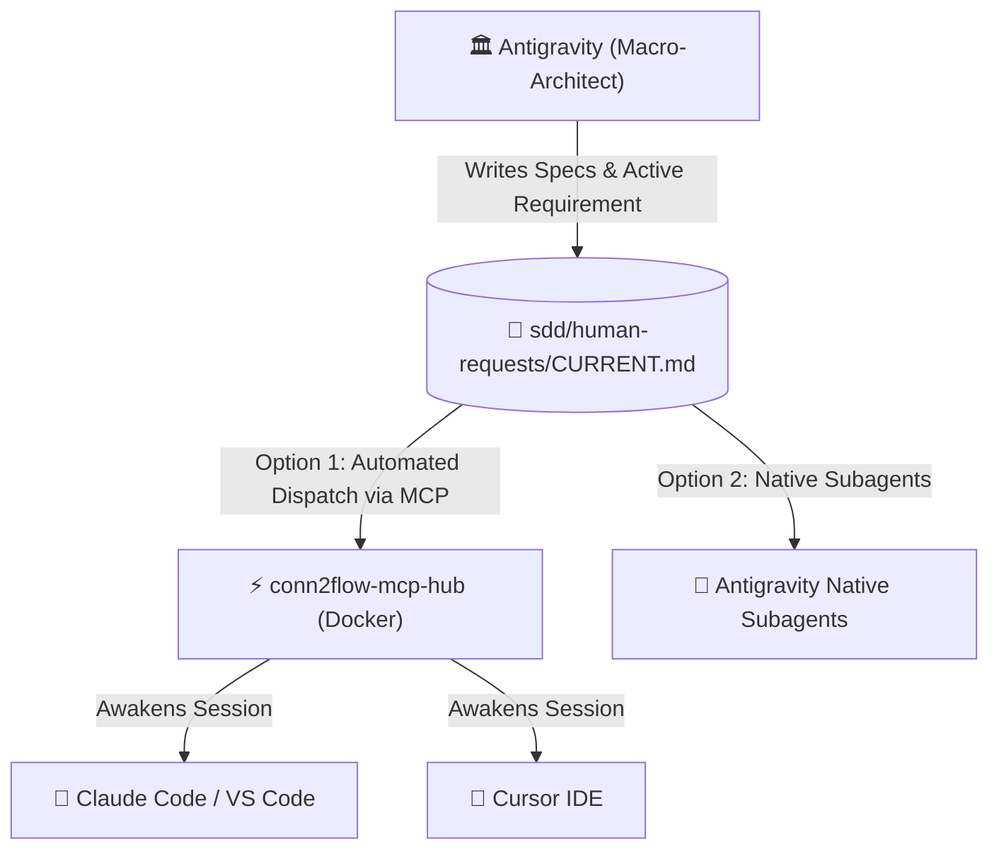
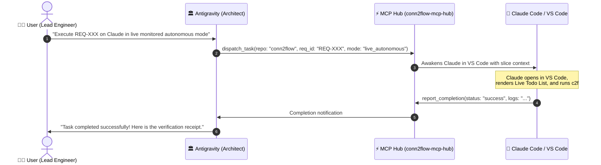

# 🧭 Multi-Agent & IDE Orchestration Playbook

This practical guide teaches how to operate the **Conn2Flow AI Framework** across multiple AI models and tools (**Google Antigravity**, **Claude Code**, **Cursor IDE**, **VS Code GitHub Copilot**, **OpenAI Codex / GPT**), ensuring **zero vendor lock-in** and automated task dispatching via the **MCP Hub**.

---

## 🎯 1. Single Source of Truth Principle

In Conn2Flow, project context **does not live inside ephemeral chat histories**. It is permanently anchored in the Git repository under `sdd/`:



---

## ⚡ 2. Automated MCP Task Dispatching (No Copy-Pasting Required)

With the MCP Hub running, you **never need to manually copy and paste prompts** between tools:



---

## 🚀 3. Direct Execution Inside Google Antigravity (Visible Subagents)

To execute tasks directly within the Antigravity IDE:

### How to prompt the Architect:
> *"Antigravity, execute the active requirement here using a subagent with model `pro` (or `flash`) in live monitored autonomous mode."*

### What happens:
1. The Architect calls `invoke_subagent`.
2. A **dedicated subagent panel/thread opens in the Antigravity interface**.
3. You can click the subagent and **watch live shell commands, file edits, and passing tests in real-time**.
4. Upon completion, the subagent returns the final receipt to the main chat.

---

## 🔄 4. Switching Between Tools when Credits Run Out

To manually switch across external IDEs and terminals:

---

### 🟣 Scenario A: Running with Claude Code (CLI / Terminal)
1. Open the terminal in the target repository (e.g. `C:\...\conn2flow`).
2. Run:
   ```bash
   claude
   ```
3. Type:
   > *"Execute the active requirement in sdd/human-requests/CURRENT.md in live monitored autonomous mode."*
4. Claude automatically reads `CLAUDE.md` and `CURRENT.md` and begins execution.

---

### 🔵 Scenario B: Out of Claude Credits ➔ Switch to Cursor IDE
1. Open the project in **Cursor IDE**.
2. Open **Composer** (`Ctrl + I`) or Chat (`Ctrl + L`).
3. Type:
   > *"Execute the active requirement in sdd/human-requests/CURRENT.md in live monitored autonomous mode."*
4. Cursor automatically loads `.cursorrules` and `.cursor/rules/sdd.mdc`.

---

### 🟢 Scenario C: Out of Cursor Credits ➔ Switch to GitHub Copilot
1. In VS Code, open **Copilot Chat** (`Ctrl + Alt + I` or `@workspace`).
2. Type:
   > *"Execute the active requirement in sdd/human-requests/CURRENT.md in live monitored autonomous mode."*
3. Copilot loads `.github/copilot-instructions.md`.

---

### 🟡 Scenario D: Return to Antigravity
1. Open Antigravity and say:
   > *"Execute the active requirement here in Antigravity with a subagent."*
2. The Architect resumes execution internally.

---

### 🟠 Scenario E: OpenAI Codex / GPT in VS Code
1. In VS Code with the official OpenAI Codex / ChatGPT extension enabled, open the chat panel.
2. Type:
   > *"Execute the active requirement in sdd/human-requests/CURRENT.md in live monitored autonomous mode."*
3. Codex automatically reads `CODEX.md`, `AGENTS.md`, and references the 33 skills in `.codex/skills/`.

---

## 🎚️ 5. The 3-Tier Autonomy Spectrum

| Level | Identifier | Operating Behavior |
| :--- | :--- | :--- |
| **Level 1** | `SUPERVISIONADO` | The agent codes and tests, but **never commits or deploys** without manual diff inspection. |
| **Level 2** | `AUTONOMO_MONITORADO` | The agent executes the entire pipeline (code, tests, local test deploy, branch commit) with a **Live Todo List visible in real-time on screen**. |
| **Level 3** | `AUTONOMO_HEADLESS` | The agent runs silently in the background via MCP Hub / Git Worktree without interactive popups. |

> [!CAUTION]
> **Golden Security Rule**: In any autonomous mode, deployment is permitted **EXCLUSIVELY in local test environments**. Automatic deployment to production is **strictly prohibited**.
