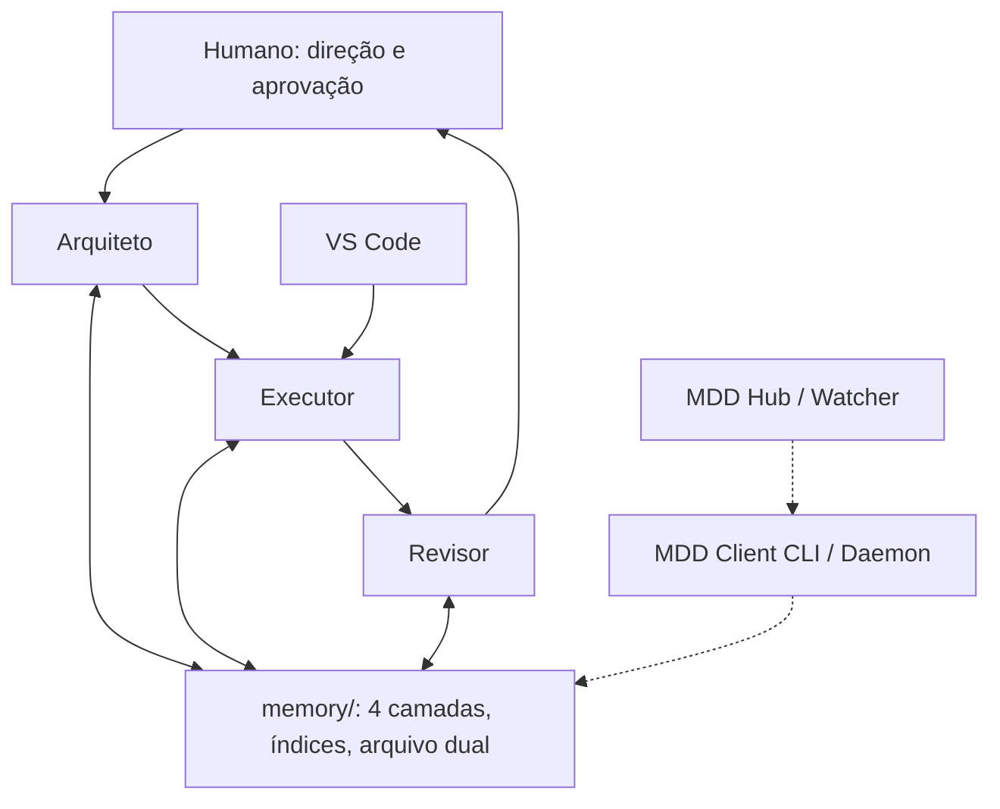

# Arquitetura da Tríade MDD

[English](../en/DOUBLE-AGENT-ARCHITECTURE.md) · [Índice da documentação](README.md)

O nome histórico do arquivo foi mantido para preservar links existentes. MDD estende o modelo original Arquiteto/Executor com um Revisor independente e memória persistente em quatro camadas.

## Responsabilidades e limites

| Papel | Trabalho obrigatório | Limite |
| --- | --- | --- |
| Arquiteto | Definir especificações aprovadas, decisões, escopo, aceite e autonomia; homologar após revisão | Não implementa nem commita código do Core/módulos |
| Executor | Ler CURRENT e a requisição, mostrar Live Todo List, implementar o slice aprovado, validar, registrar evidências no lote/checklist e emitir recibo | Não inventa aprovação, altera contratos fora do escopo ou faz deploy de produção implícito |
| Revisor | Inspecionar diffs e fontes vigentes, relatar findings por gravidade com evidências, emitir parecer independente | Não declara PASS em verificações não executadas; revisar não homologa por si só |
| Humano | Direcionar prioridades, autorizar escopo e revisar consolidação | Mantém o gate de aprovação exigido pelo workflow selecionado |

Os procedimentos dos papéis são [Arquiteto](../../.gemini/skills/c2f-architect-master/SKILL.md), [Executor](../../.gemini/skills/c2f-executor-agent/SKILL.md) e [Revisor](../../.gemini/skills/c2f-reviewer-agent/SKILL.md). O [catálogo](CATALOGO-DE-SKILLS.md) de 44 skills explica os procedimentos por tarefa.

## Memória compartilhada e ciclo de vida

Consulte primeiro o router da fundação, CURRENT e o índice pertinente. Evidência episódica registra execução; memória semântica registra conhecimento aprovado; skills fornecem procedimentos; notas raw continuam não normativas. A [especificação do framework](ESPECIFICACAO-FRAMEWORK-MDD.md) explica retenção e arquivos duais.

A sequência operacional é **briefing → lote aprovado → execução e verificações → revisão independente → homologação humana/do Arquiteto**. Itens de backlog não autorizam execução até promoção explícita para requisição aprovada. Conflitos de contrato voltam pela governança de change requests.

## Topologia e autonomia são separadas

O painel suporta topologias dupla e tríade. O modo duplo combina revisão com o Arquiteto; a tríade atribui um Revisor distinto. Nenhuma topologia altera o escopo aprovado.

| Workflow | Alias no CURRENT | Modo atual de despacho MCP | Significado |
| --- | --- | --- | --- |
| supervised | supervisionado | supervised | Implementar e verificar; humano aprova consolidação |
| monitored | autonomo_monitorado | live_autonomous | Progredir continuamente com Live Todo List visível e evidências |
| headless | autonomo_headless | headless_autonomous | Trabalho em background autorizado, com recibos e condições de parada |

O Hub Python previsto usa headless/monitored/reviewer para evolução documental. Esses nomes não devem ser enviados sem conversão para dispatch_task do MCP. O modo autônomo não autoriza produção nem amplia escopo.

## Handoffs e consolidação

Todo handoff informa projeto, raiz absoluta do repositório, REQ, BATCH, estado atual, evidências e próxima ação. Use memory/ na matriz; resolva a raiz real de governança de cada satélite sem presumir migração concluída.

Commite somente arquivos nomeados. Pipelines de recursos rodam sequencialmente pelos comandos CLI oficiais; nunca copie arquivos para espelhos de teste. O Revisor informa gravidade, impacto concreto e evidência reproduzível antes da consolidação final. Mantenha limitações e verificações não executadas visíveis no relatório do lote.
