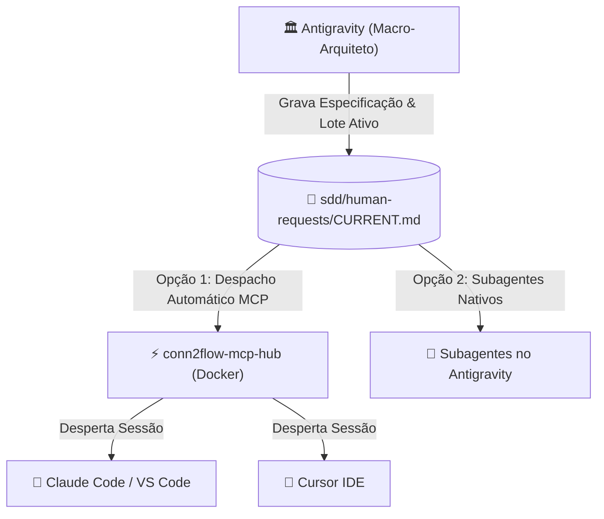
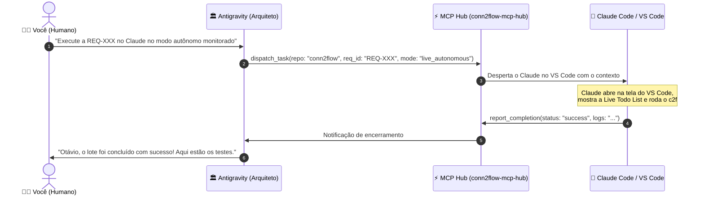

# 🧭 Playbook de Orquestração Multi-Agentes & Alternância entre IDEs

Este playbook prático ensina como operar o **Conn2Flow AI Framework** com múltiplos modelos e ferramentas de IA (**Google Antigravity**, **Claude Code**, **Cursor IDE**, **VS Code GitHub Copilot**, **OpenAI Codex / GPT**), garantindo **portabilidade total (Zero Vendor Lock-in)** e automação contínua via **MCP Hub**.

---

## 🎯 1. O Princípio da Fonte Única de Verdade (Single Source of Truth)

No Conn2Flow, a inteligência do projeto **não fica presa no histórico de um chat específico**. Ela reside no próprio repositório Git sob a pasta de governança `sdd/`:



---

## ⚡ 2. O Fluxo de Despacho Automático via MCP Hub (Sem Copiar e Colar)

Com o servidor MCP Hub ativo, você **não precisa copiar e colar prompts** entre as telas:



---

## 🚀 3. Execução Direta no Google Antigravity (Com Subagentes Visíveis)

Quando você quiser que a execução aconteça diretamente dentro do Antigravity:

### Como orientar o Arquiteto:
> *"Antigravity, execute a requisição atual aqui mesmo usando um subagente com o modelo `pro` (ou `flash`) no modo autônomo monitorado."*

### O que acontece:
1. O Arquiteto invoca `invoke_subagent`.
2. Uma **aba/janela dedicada do subagente** abre na interface lateral do Antigravity.
3. Você pode clicar no subagente e **ver ao vivo os comandos sendo digitados, arquivos alterados e testes passando**.
4. Ao concluir, o subagente devolve o relatório na conversa principal.

---

## 🔄 4. Como Alternar entre Ferramentas quando os Créditos Acabarem

Caso você queira abrir manualmente as ferramentas no terminal ou IDE:

---

### 🟣 Cenário A: Executar com Claude Code (CLI / Terminal)
1. Abra o terminal no repositório desejado (ex: `C:\...\conn2flow`).
2. Digite:
   ```bash
   claude
   ```
3. Digite apenas:
   > *"Execute a requisição ativa em sdd/human-requests/CURRENT.md no modo autônomo monitorado."*
4. O Claude lê o `CLAUDE.md` e o `CURRENT.md` e inicia a esteira completa.

---

### 🔵 Cenário B: Acabou o crédito no Claude ➔ Mudar para o Cursor IDE
1. Abra a pasta do projeto no **Cursor IDE**.
2. Abra o **Composer** (`Ctrl + I`) ou o Chat (`Ctrl + L`).
3. Digite:
   > *"Execute a requisição ativa em sdd/human-requests/CURRENT.md no modo autônomo monitorado."*
4. O Cursor lê automaticamente o `.cursorrules` e `.cursor/rules/sdd.mdc` e executa com o modelo selecionado no Cursor (ex: GPT-4o, Sonnet, etc.).

---

### 🟢 Cenário C: Acabou o crédito no Cursor ➔ Mudar para o GitHub Copilot
1. No VS Code, abra o **Copilot Chat** (`Ctrl + Alt + I` ou `@workspace`).
2. Digite:
   > *"Execute a requisição ativa em sdd/human-requests/CURRENT.md no modo autônomo monitorado."*
3. O Copilot lê o `.github/copilot-instructions.md` e executa a tarefa.

---

### 🟡 Cenário D: Acabou tudo fora ➔ Voltar para o Antigravity
1. Abra o chat do Antigravity e diga:
   > *"Execute a requisição aqui no Antigravity com subagente."*
2. O Arquiteto assume a execução internamente.

---

### 🟠 Cenário E: OpenAI Codex / GPT no VS Code
1. No VS Code com a extensão oficial OpenAI Codex / ChatGPT ativa, abra o painel de chat.
2. Digite:
   > *"Execute a requisição ativa em sdd/human-requests/CURRENT.md no modo autônomo monitorado."*
3. O Codex lê automaticamente as instruções de `CODEX.md`, `AGENTS.md` e consulta as 36 skills em `.codex/skills/`.

---

## 🎚️ 5. Espectro dos 3 Níveis de Autonomia

| Nível | Identificador | Comportamento |
| :--- | :--- | :--- |
| **Nível 1** | `SUPERVISIONADO` | O agente codifica e testa, mas **não faz commit nem deploy** sem revisão prévia de diffs. |
| **Nível 2** | `AUTONOMO_MONITORADO` | O agente executa a esteira completa (código, testes, deploy em testes locais e commit na branch) com **Live Todo List visível na tela em tempo real**. |
| **Nível 3** | `AUTONOMO_HEADLESS` | O agente roda em segundo plano isolado via MCP Hub / Git Worktree sem janelas interativas. |

> [!CAUTION]
> **Regra de Ouro de Segurança**: Em qualquer modo autônomo, o deploy é permitido **EXCLUSIVAMENTE em ambiente de testes local**. É **estritamente proibido** realizar deploy automático em ambiente de produção.

---

## 🖥️ 6. Claude Code Desktop (Code Tab) & Recursos Nativos

O Claude Code Desktop oferece um ambiente visual completo com abas de código, navegador integrado e isolamento de tarefas:

### 6.1. Isolamento de Worktrees com `.worktreeinclude`
Ao disparar tarefas concorrentes ou usar a flag `--worktree`, o Claude Desktop cria diretórios isolados em `.claude/worktrees/`. O arquivo `.worktreeinclude` na raiz do repositório garante a replicação automática de arquivos não rastreados pelo Git essenciais para o runtime:
```text
.env
.env.local
dev-environment/data/environment.json
temp/agent-cookies.txt
```
Isso elimina falhas de conexão de banco de dados Docker ou permissões de sessão ao operar em branches paralelas.

### 6.2. Autoverificação Visual no Browser Pane (`.claude/launch.json`)
Com o arquivo `.claude/launch.json` configurado na raiz de `.claude/`:
```json
{
  "version": "0.0.1",
  "autoVerify": true,
  "configurations": [
    {
      "name": "conn2flow-local",
      "url": "http://localhost"
    }
  ]
}
```
A flag `"autoVerify": true` habilita a inspeção autônoma pelo Browser Pane do Claude Desktop. Após cada modificação em componentes visuais, telas ou layouts, o próprio Claude inspeciona o DOM em `http://localhost`, coleta screenshots e valida a renderização sem necessidade de intervenção do operador.

### 6.3. Transição Terminal ➔ Desktop (`/desktop`)
Se você iniciou uma sessão de terminal via CLI (`claude`) e deseja transferir a conversa ativa, histórico de execução e diffs para a interface gráfica, execute no prompt do Claude:
```bash
/desktop
```
A sessão é migrada instantaneamente para o Claude Code Desktop com todo o contexto preservado.

### 6.4. Side Chats Rápidos com `/btw` (ou `Ctrl + ;`)
Durante uma execução autônoma orientada a especificações (SDD), você pode abrir um **Side Chat** digitando `/btw <pergunta>` ou pressionando `Ctrl + ;`:
* O Side Chat herda instantaneamente todo o contexto técnico da thread principal;
* As mensagens trocadas no Side Chat **não poluem o histórico da thread principal** nem interferem no rastreamento de lotes (`CURRENT.md` / `batch-XXX.md`);
* Ideal para esclarecer dúvidas arquiteturais, testar snippets ou validar ideias antes de direcionar o executor.

---

## 🌐 7. Comunicação Cross-Session, Modo Goal e Plugin conn2flow-devkit

### 7.1. Cross-Session Messaging (`@sessao` & `crossSessionInbound`)
Com a configuração `"crossSessionInbound": "allow"` ativa em `.claude/settings.json`, agentes executando em sessões diferentes no mesmo computador podem se comunicar diretamente:
* **Coordenação Core ↔ Projetos**: Um agente trabalhando em `conn2flow` pode enviar notificações de atualização ou breaking changes para um agente atuando em `transformamp` ou `lumix`:
  ```text
  @transformamp Atualizamos o Core para 6 etapas com css:rebuild obrigatório. Execute c2f project:update-all transformamp-local para validar.
  ```
* **Privacidade e Isolamento**: Cada sessão mantém seu próprio histórico e estado local, recebendo apenas mensagens explicitamente endereçadas.

### 7.2. Goal Mode (`/goal`) para Execução Contínua no SDD
Para fatias complexas que envolvem múltiplos arquivos, migrações de banco ou compilação Tailwind, ative o comando `/goal` no início do prompt:
```bash
/goal Execute a fatia BATCH-XXX conforme sdd/human-requests/CURRENT.md até que todos os testes do VALIDATION-CHECKLIST.md passem e o relatório esteja preenchido.
```
* O agente não interrompe a execução prematuramente solicitando confirmações intermediárias para tarefas já aprovadas na especificação;
* O loop só é concluído quando os critérios de aceite forem deterministamente satisfeitos e registrados.

### 7.3. Plugin Oficial Conn2Flow (`conn2flow-devkit`)
A infraestrutura de IA do Conn2Flow suporta empacotamento como plugin oficial do Claude Code através do manifesto `.claude-plugin/plugin.json`:
* Contém as **36 skills normativas** e hooks determinísticos (`PreToolUse`);
* Permite instalação 1-Click em qualquer novo repositório ou projeto Conn2Flow sem necessidade de copiar manualmente dezenas de arquivos de configuração.

---

## ⚡ 8. Google Antigravity & Antigravity IDE: Ecossistema Nativo de Execução e Revisão

O Google Antigravity não atua apenas como Macro-Arquiteto, mas agora oferece capacidade nativa de execução e auditoria técnica diretamente no Antigravity 2.0 Desktop, Antigravity IDE e Antigravity CLI (`agy`).

### 8.1. Subagentes Especializados Nativos
O workspace define formalmente subagentes que podem ser invocados diretamente pelo Antigravity:
* **`c2f_executor`**: Focado em implementação com ferramentas de escrita (`write_to_file`, `replace_file_content`, `run_command`). Lê `CURRENT.md`, mantém a Live Todo List (`[ ]` ➔ `[x]`), roda o pipeline oficial (`c2f manager:update-all` ou `c2f project:update-all`) e executa testes.
* **`c2f_reviewer`**: Focado em auditoria técnica e homologação. Inspeciona diffs do Git, valida conformidade com as regras em `.gemini/rules/`, roda `c2f ai:sync` e `c2f css:audit`, e emite o parecer em `sdd/validation/review-YYY.md`.

### 8.2. Regras Modulares de Contexto (`.gemini/rules/`)
O Antigravity IDE carrega automaticamente diretrizes contextuais do diretório `.gemini/rules/`:
* `01-sdd-governance.md`: Travas de governança viva, proibição de `git add -A` e bloqueio de cópia manual para ambientes de teste.
* `02-core-crud-v2.md`: Scaffold de CRUD V2, obrigatoriedade de `variables.json` e CSRF em AJAX.
* `03-resources-tailwind.md`: Taxonomia dos 11 recursos, Version Bump e integridade do Tailwind CSS v4.

### 8.3. Orquestração Multi-Modelo e Hook Stop
* **Gemini 3.7 Flash**: Recomendado como motor primário do `c2f_executor` para execuções ultrarrápidas de código e testes.
* **Gemini 4 / Pro**: Indicado para o `c2f_reviewer` e para o Macro-Arquiteto em refatorações profundas.
* **Hook `Stop`**: Configurado em `.gemini/hooks.json` para interceptar a finalização e validar se todas as exigências do `VALIDATION-CHECKLIST.md` foram cumpridas antes do encerramento da sessão.


