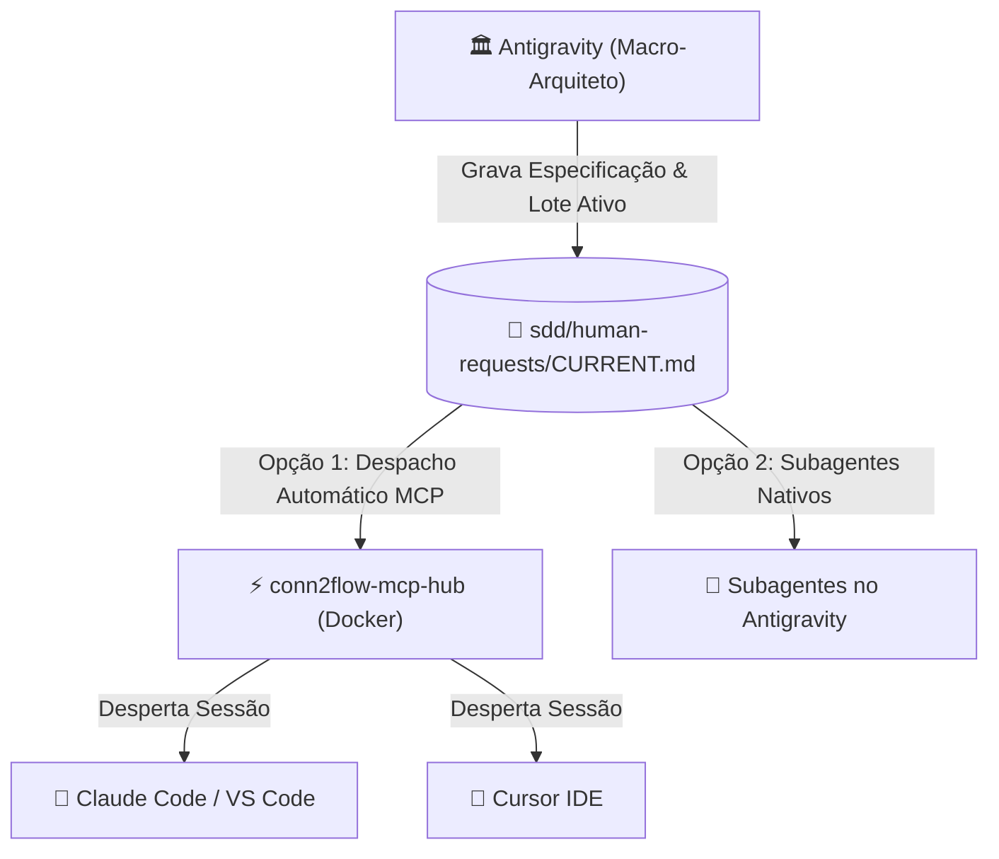
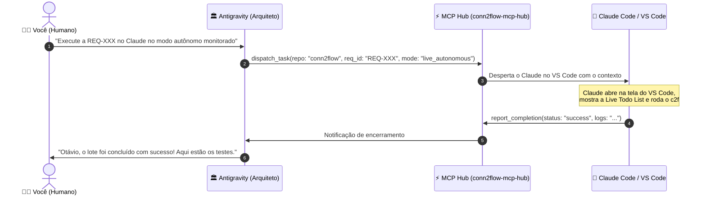

# 🧭 Playbook de Orquestração Multi-Agentes & Alternância entre IDEs

Este playbook prático ensina como operar o **Conn2Flow AI Framework** com múltiplos modelos e ferramentas de IA (**Google Antigravity**, **Claude Code**, **Cursor IDE**, **VS Code GitHub Copilot**, **OpenAI Codex / GPT**), garantindo **portabilidade total (Zero Vendor Lock-in)** e automação contínua via **MCP Hub**.

---

## 🎯 1. O Princípio da Fonte Única de Verdade (Single Source of Truth)

No Conn2Flow, a inteligência do projeto **não fica presa no histórico de um chat específico**. Ela reside no próprio repositório Git sob a pasta de governança `sdd/`:



---

## ⚡ 2. O Fluxo de Despacho Automático via MCP Hub (Sem Copiar e Colar)

Com o servidor MCP Hub ativo, você **não precisa copiar e colar prompts** entre as telas:



---

## 🚀 3. Execução Direta no Google Antigravity (Com Subagentes Visíveis)

Quando você quiser que a execução aconteça diretamente dentro do Antigravity:

### Como orientar o Arquiteto:
> *"Antigravity, execute a requisição atual aqui mesmo usando um subagente com o modelo `pro` (ou `flash`) no modo autônomo monitorado."*

### O que acontece:
1. O Arquiteto invoca `invoke_subagent`.
2. Uma **aba/janela dedicada do subagente** abre na interface lateral do Antigravity.
3. Você pode clicar no subagente e **ver ao vivo os comandos sendo digitados, arquivos alterados e testes passando**.
4. Ao concluir, o subagente devolve o relatório na conversa principal.

---

## 🔄 4. Como Alternar entre Ferramentas quando os Créditos Acabarem

Caso você queira abrir manualmente as ferramentas no terminal ou IDE:

---

### 🟣 Cenário A: Executar com Claude Code (CLI / Terminal)
1. Abra o terminal no repositório desejado (ex: `C:\...\conn2flow`).
2. Digite:
   ```bash
   claude
   ```
3. Digite apenas:
   > *"Execute a requisição ativa em sdd/human-requests/CURRENT.md no modo autônomo monitorado."*
4. O Claude lê o `CLAUDE.md` e o `CURRENT.md` e inicia a esteira completa.

---

### 🔵 Cenário B: Acabou o crédito no Claude ➔ Mudar para o Cursor IDE
1. Abra a pasta do projeto no **Cursor IDE**.
2. Abra o **Composer** (`Ctrl + I`) ou o Chat (`Ctrl + L`).
3. Digite:
   > *"Execute a requisição ativa em sdd/human-requests/CURRENT.md no modo autônomo monitorado."*
4. O Cursor lê automaticamente o `.cursorrules` e `.cursor/rules/sdd.mdc` e executa com o modelo selecionado no Cursor (ex: GPT-4o, Sonnet, etc.).

---

### 🟢 Cenário C: Acabou o crédito no Cursor ➔ Mudar para o GitHub Copilot
1. No VS Code, abra o **Copilot Chat** (`Ctrl + Alt + I` ou `@workspace`).
2. Digite:
   > *"Execute a requisição ativa em sdd/human-requests/CURRENT.md no modo autônomo monitorado."*
3. O Copilot lê o `.github/copilot-instructions.md` e executa a tarefa.

---

### 🟡 Cenário D: Acabou tudo fora ➔ Voltar para o Antigravity
1. Abra o chat do Antigravity e diga:
   > *"Execute a requisição aqui no Antigravity com subagente."*
2. O Arquiteto assume a execução internamente.

---

### 🟠 Cenário E: OpenAI Codex / GPT no VS Code
1. No VS Code com a extensão oficial OpenAI Codex / ChatGPT ativa, abra o painel de chat.
2. Digite:
   > *"Execute a requisição ativa em sdd/human-requests/CURRENT.md no modo autônomo monitorado."*
3. O Codex lê automaticamente as instruções de `CODEX.md`, `AGENTS.md` e consulta as 33 skills em `.codex/skills/`.

---

## 🎚️ 5. Espectro dos 3 Níveis de Autonomia

| Nível | Identificador | Comportamento |
| :--- | :--- | :--- |
| **Nível 1** | `SUPERVISIONADO` | O agente codifica e testa, mas **não faz commit nem deploy** sem revisão prévia de diffs. |
| **Nível 2** | `AUTONOMO_MONITORADO` | O agente executa a esteira completa (código, testes, deploy em testes locais e commit na branch) com **Live Todo List visível na tela em tempo real**. |
| **Nível 3** | `AUTONOMO_HEADLESS` | O agente roda em segundo plano isolado via MCP Hub / Git Worktree sem janelas interativas. |

> [!CAUTION]
> **Regra de Ouro de Segurança**: Em qualquer modo autônomo, o deploy é permitido **EXCLUSIVAMENTE em ambiente de testes local**. É **estritamente proibido** realizar deploy automático em ambiente de produção.
