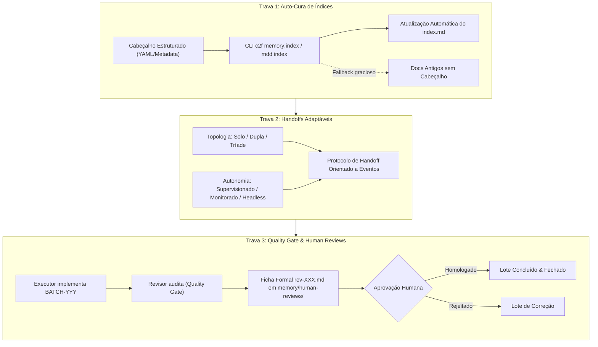

# ARCH-015: Mecânica de Tríade Autônoma Headless, Trava Tripla de Governança e Caixa de Entrada Humana (`memory/human-reviews/`)

- **Tipo**: Arquitetura / Governança MDD / Autonomia Multi-Agente
- **Status**: `PROMOTED` (promovido para `REQ-072` / `BATCH-074` em 2026-10-09)
- **Origem**: Humano-no-Loop (Engenheiro Chefe)
- **Lote Relacionado**: `BATCH-074`
- **Data de Criação**: 2026-10-09

---

## 🎯 1. Contexto & Motivação

Durante a operação real com múltiplos modelos de IA e a evolução das requisições recentes (em especial a transição SDD ➔ MDD no `REQ-067` e os feedbacks de execução do `REQ-266` no Core), foi identificada a necessidade crítica de dar sustentação mecânica aos fluxos de trabalho, permitindo que a Tríade de Agentes opere com estabilidade tanto no modo supervisionado quanto em modos de alta autonomia (`autonomo_monitorado` e `autonomo_headless`).

Três pontos de atrito frequentes foram isolados:
1. **Desgaste de Índices (`index.md`)**: A atualização manual dos índices por agentes LLM consome tokens de contexto e é propensa a erros de formatação ou esquecimento, quebrando a integridade de links relativos.
2. **Rigidez nos Handoffs**: O fluxo de passagem de bastão precisa se adaptar fluidamente às topologias do time (`solo`, `dupla`, `triade`) e ao nível de autonomia configurado pelo operador humano.
3. **Ausência de Inbox Formal de Homologação**: O humano precisa de um local centralizado e padronizado para revisar entregas de alto nível (`rev-XXX.md`), sem precisar caçar evidências espalhadas em dezenas de arquivos de implementação ou checklists técnicos.

Para resolver definitivamente esses desafios, este item arquitetural estabelece a **Trava Tripla de Governança MDD**.

---

## 🔒 2. A Trava Tripla de Governança MDD



---

### 2.1 Trava 1: Template de Cabeçalho Estruturado (Metadata Header) & Auto-Cura de Índices

Para eliminar o esforço manual de manter as tabelas de `index.md`, todo documento de governança passa a adotar um bloco de metadados padronizado.

#### A. Especificação do Cabeçalho Canônico (YAML Frontmatter / Markdown Block)

O bloco é posicionado no topo de cada documento Markdown (`.md`):

```markdown
---
id: REQ-072
title: Implementação da Trava Tripla MDD e Human Reviews
status: APPROVED
date: 2026-10-09
author: architect
target_repo: conn2flow-ai-workspace
summary_short: Template estruturado de cabeçalho, auto-cura de índices via CLI, handoffs adaptáveis e pasta canônica memory/human-reviews/
summary_medium: Estabelece travas mecânicas para autonomia de agentes: extração automática de metadados para index.md, protocolo de handoff flexível e caixa de entrada formal para aprovação humana.
---
```

#### B. Campos Padronizados
- `id` (obrigatório): Identificador único (ex: `REQ-072`, `BATCH-074`, `ARCH-015`, `REV-001`, `DEC-012`).
- `title` (obrigatório): Título oficial do documento.
- `status` (obrigatório): Estado no ciclo de vida (`DRAFT`, `READY-FOR-INTAKE`, `APPROVED`, `IN-PROGRESS`, `READY-FOR-REVIEW`, `HOMOLOGATED`, `ICEBOX`, `PROMOTED`, `ARCHIVED`).
- `date` (obrigatório): Data ISO (`YYYY-MM-DD`).
- `author` (obrigatório): Papel autor (`human`, `architect`, `executor`, `reviewer`).
- `target_repo` (opcional/contextual): Repositório alvo.
- `summary_short` (obrigatório): Resumo executivo em linha única (30 a 140 caracteres). Este campo é injetado diretamente na coluna **Resumo Executivo** da tabela de `index.md`.
- `summary_medium` (opcional): Resumo de 2 a 3 linhas para tooltips ou documentação estendida.

#### C. Ferramentas de Auto-Cura (`index`)
- **No Core PHP**: Comando `c2f memory:index [caminho]` (ou `php cli/c2f.php memory:index`).
- **No Python (MDD Client / Hub)**: Comando `mdd index [caminho]`.
- **Comportamento do Script**:
  1. Varre a pasta indicada (ou todas as pastas de `memory/`).
  2. Extrai os metadados estruturados de cada arquivo.
  3. Reconstrói a tabela do `index.md` correspondente com links relativos válidos, status e o `summary_short`.
  4. Ordena numericamente/cronologicamente de forma determinística.

#### D. Regra de Fallback Gracioso (Transição Suave para Arquivos Legados)
Para evitar a necessidade de refatorar centenas de arquivos históricos já existentes no repositório:
- Se o arquivo **não** contiver o bloco `---` de metadados:
  - O script extrai o título da primeira linha de cabeçalho (`# Título`).
  - O script extrai a primeira linha de texto não vazia (ou primeiro parágrafo) e a trunca em até 120 caracteres para compor o `summary_short`.
  - O link relativo e o nome do arquivo são mapeados normalmente.
  - O processo é 100% tolerante a falhas, garantindo **zero breaking changes** com arquivos antigos.

#### E. CLI de Mutação Atômica de Metadados e Índices (`memory:set` / `memory:meta`)
Em vez de um agente de IA precisar abrir o arquivo, fazer regex ou substituição manual de texto e depois abrir o `index.md` para alterar a tabela (processo lento e propenso a falhas de formatação):
1. **Comando de Mutação Rápida**:
   - PHP Core: `c2f memory:set <alvo> --status=<novo_status> [--campo=<valor>]` (ex: `c2f memory:set req-072 --status=IN-PROGRESS`).
   - Python MDD: `mdd meta set <alvo> <campo> <valor>`.
2. **Atualização Atômica**:
   - O comando lê o cabeçalho YAML frontmatter do arquivo alvo (ou o injeta caso não exista).
   - Atualiza a variável solicitada (`status`, `summary_short`, `title`, etc.) ou cria variáveis customizadas arbitrárias (`tags`, `priority`, `assignee`, etc.).
   - Salva o arquivo e **automaticamente re-sincroniza o `index.md`** da pasta correspondente em tempo real.
3. **Comando de Leitura Rápida**:
   - `c2f memory:get <alvo> [campo]` (retorna o valor ou o bloco de metadados em JSON para fácil consumo por scripts e ferramentas).

#### F. Nova Skill Canônica
- Criar a **45ª Skill**: `c2f-mdd-indexing-and-handoffs` em `.gemini/skills/` (com espelhamento em `.claude/`, `.cursor/`, `.codex/` e `.github/`).

---

### 2.2 Trava 2: Handoffs Adaptáveis Orientados a Eventos

O protocolo de handoff deixa de ser um fluxo rígido de comando único e passa a suportar matrizes combinatórias configuradas em `memory/human-requests/CURRENT.md`:

#### A. Topologias Suportadas
1. **`solo`**: Um único agente assume os três papéis sequencialmente (ideal para tarefas táticas pequenas e correções rápidas).
2. **`dupla`**: Macro-Arquiteto (planejamento de alto nível e homologação) + Executor Tático (implementação e testes).
3. **`triade`**: Macro-Arquiteto + Executor Tático + Revisor Técnico / Auditor de Qualidade independente.

#### B. Níveis de Autonomia
1. **`supervisionado`**: Parada mandatória a cada transição de etapa (Arquiteto planeja ➔ aguarda Humano ➔ Executor implementa ➔ aguarda Humano ➔ Revisor audita ➔ aguarda Humano para fechar lote).
2. **`autonomo_monitorado`**: Execução autônoma de fatias inteiras com logs desbufferizados; parada apenas no fechamento do lote ou em bloqueios impeditivos.
3. **`autonomo_headless`**: Tríade opera em pipeline completo via eventos/recibos (`completions/`):
   - Arquiteto aprova requisição ➔ notifica Executor.
   - Executor conclui implementação ➔ emite recibo ➔ notifica Revisor.
   - Revisor audita ➔ se reprovado, gera lote de correção; se aprovado, emite `rev-XXX.md` e conclui.

#### C. Contrato do Prompt de Handoff
Todo handoff entre agentes ou para o humano DEVE conter:
- Identificador do projeto e raiz absoluta do repositório alvo.
- Branch ativo e último commit verificado.
- Lote ativo (`BATCH-YYY`) e requisição (`REQ-XXX`).
- Topologia e nível de autonomia declarados.
- Próximo comando acionável.

---

### 2.3 Trava 3: Quality Gate e Caixa de Entrada Canônica (`memory/human-reviews/`)

Para garantir que a velocidade dos agentes não comprometa a governança e para valorizar o olhar clínico do Humano-no-Loop, estabelece-se a pasta canônica `memory/human-reviews/`.

#### A. O Conceito da Pasta Canônica `memory/human-reviews/`
Assim como `memory/human-requests/` é a entrada de comandos humanos para as IAs, `memory/human-reviews/` é a **Caixa de Entrada Oficial de Homologação** das IAs para o Humano:
- Estrutura física padronizada:
  ```text
  memory/human-reviews/
  ├── README.md
  ├── index.md
  ├── rev-001.md
  ├── rev-002.md
  └── archive/
      ├── README.md
      ├── index.md
      ├── compacted/
      │   └── index.md
      └── original/
          └── index.md
  ```
- **Regra dos 10 Ativos**: Mantém no máximo 10 fichas `rev-XXX.md` ativas na raiz da pasta. Fichas antigas são movidas para `archive/`.

#### B. Anatomia da Ficha de Homologação (`rev-XXX.md`)
Cada ficha gerada pelo Revisor/Arquiteto contém:
1. **Cabeçalho Estruturado** com status inicial (`READY-FOR-HUMAN-REVIEW`).
2. **Resumo Executivo da Entrega** (linguagem clara, direta e de alto nível).
3. **Mapeamento de Riscos e Segurança** (CSRF, variáveis, permissões, regressões).
4. **Evidências de Teste** (suítes executadas, status de saída).
5. **Veredito Técnico do Revisor** (`RECOMMEND-APPROVAL`, `RECOMMEND-REVISION`).
6. **Assinatura do Humano-no-Loop**:
   - `[ ] Homologado por: _________________ em ____/____/________`
   - Notas de feedback do operador humano.

---

## 🚀 3. Plano de Implantação e Transição

Este épico é promovido para execução imediata no ecossistema:
1. **Requisição Formal**: `REQ-072` em `memory/human-requests/req-072.md`.
2. **Lote de Implementação**: `BATCH-074` em `memory/implementation/batch-074.md`.
3. **Fase 1 (Estrutural)**: Provisionamento de `memory/human-reviews/` e criação da 45ª Skill `c2f-mdd-indexing-and-handoffs`.
4. **Fase 2 (Ferramental)**: Implementação do parser e comando de auto-cura no Core PHP (`c2f memory:index`) e no MDD Client Python (`mdd index`).
5. **Fase 3 (Propagação)**: Atualização das políticas (`01-general-memory.md`, `02-policy.md`), boilerplates em `templates/` e difusão nos repositórios satélites.
