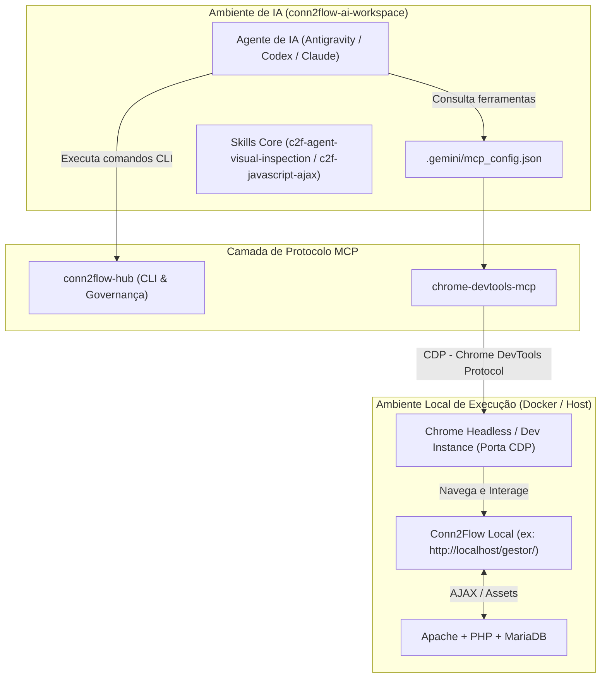

# ARCH-008 — Chrome DevTools MCP Server para Inspeção e Depuração em Tempo Real do Runtime PHP/JS

* **Status**: `ICEBOX` — registrado para análise e planejamento futuro; aguardando promoção formal via intake humano.
* **Tipo**: Arquitetura de IA / Infraestrutura MCP / Depuração de Runtime
* **Autor**: Macro-Arquiteto (provocado por análise do Humano-no-Loop)
* **Data de Criação**: 2026-10-01
* **Repositórios Alvo**: `conn2flow-ai-workspace` (Matriz Central), `conn2flow` (Core), `conn2flow-site` e templates
* **Referência Externa**: [Chrome DevTools Blog (Outubro/2026) — DevTools para Agentes](https://developer.chrome.com/blog/new-in-devtools-october-2026?hl=pt-br#mcp) e [ChromeDevTools/chrome-devtools-mcp](https://github.com/ChromeDevTools/chrome-devtools-mcp)

---

## 1. Contexto e Diagnóstico

### 1.1 A Realidade Arquitetural do Conn2Flow
O Conn2Flow possui uma arquitetura híbrida clássica e dinâmica:
- **Backend / Renderização**: PHP executa e gera o HTML no servidor a partir de registros do banco de dados (`gestor/modulos/...`).
- **Frontend / Dinamismo**: Uso intensivo de JavaScript vanilla, jQuery, componentes de interface (Semantic UI / Interface v2, Tailwind CSS), editores (Quill), formulários com validações assíncronas e requisições dinâmicas para endpoints `/_ajax/` ou `/_api/`.
- **Limitação Histórica dos Agentes**:
  Hoje, os agentes de IA (Antigravity, Codex, Claude Code) atuam no código por meio de **inspeção estática** (leitura de arquivos `.php`, `.js`, `.html`, `.json`) e testes automatizados com mocks ou stubs (como `tests/Unit/JS/helpers/jquery-stub.js` e PHPUnit).
  Eles **não possuem "olhos" e "mãos" no navegador em tempo real**. Não conseguem:
  1. Ver mensagens de erro de console JavaScript geradas durante a execução real de um módulo.
  2. Inspecionar respostas HTTP de endpoints AJAX que falham silenciosamente (ex: CSRF expirado, status 403/500, JSON malformado).
  3. Visualizar o DOM final montado após scripts dinâmicos rodarem.
  4. Analisar conflitos visuais de CSS/Tailwind (ex: regras sobrepostas ou estilos inativos).

### 1.2 O que é o Chrome DevTools MCP?
O **Chrome DevTools MCP** (`chrome-devtools-mcp`) é um servidor oficial sob o padrão **Model Context Protocol (MCP)** mantido pela equipe do Chrome DevTools (Google).
Ele conecta ferramentas de IA diretamente a uma instância em execução do Google Chrome por meio do **Chrome DevTools Protocol (CDP)**, expondo primitivas de depuração diretamente como ferramentas MCP acionáveis por agentes.

---

## 2. Recursos Relevantes do Lançamento (Outubro/2026)

A edição de Outubro/2026 do Chrome DevTools introduziu melhorias de segurança e performance focadas diretamente em agentes de codificação:

1. **Stack Traces no Console (`list_console_messages`)**:
   - Agentes podem listar avisos e erros do console com stack traces completos.
   - Permite identificar instantaneamente o arquivo `.js`, linha e função que causou uma exceção no frontend do Conn2Flow.

2. **Controle de Avaliação de Scripts (`--no-javascript-evaluation`)**:
   - Permite inspecionar a árvore DOM e recursos da página sem executar scripts intrusivos ou perigosos, estendendo-se por navegações e scripts de inicialização.

3. **Mapas de Origem sob Demanda (On-Demand Source Maps)**:
   - Carregamento lento (*lazy*) de source maps, evitando consumo excessivo de memória em módulos grandes ou bibliotecas minificadas (`.min.js`).

4. **Permissões de Caminho da CLI e Raízes de Arquivo (`--allow-unrestricted-paths`)**:
   - Facilita a correlação de arquivos locais servidos pelo ambiente de desenvolvimento (`gestor/modulos/...`) com a sessão do navegador.

5. **Agent Plugins 1.0**:
   - Suporte modular a plugins para agentes, abrindo caminho para extensões personalizadas que conheçam regras específicas de frameworks.

6. **Consultas de Alocação de Memória (`query_heapsnapshot`)**:
   - Permite inspecionar fugas de memória (memory leaks) e retenções de contexto no V8 em páginas complexas do gestor.

7. **Outras Novidades Valiosas do DevTools**:
   - **Estilos Inativos em "Elementos"**: Indicador visual e marcação de regras CSS que foram combinadas, mas não têm efeito no elemento, facilitando enormemente o saneamento de Tailwind CSS e estilos legados.
   - **"Editar e reenviar como busca no console"**: Copia de requisições de rede diretamente como expressões `fetch()`, acelerando o teste de rotas `_ajax/`.

---

## 3. Proposta de Arquitetura para o Ecossistema Conn2Flow

### 3.1 Topologia de Integração MCP

### 3.2 Ferramentas MCP Disponíveis para os Agentes

Com a adição do servidor `chrome-devtools-mcp`, os agentes ganham acesso nativo às seguintes ferramentas:

| Ferramenta | Propósito no Conn2Flow |
|---|---|
| `navigate_page` | Navegar para telas locais (ex: login, listagem de páginas, formulário de edição). |
| `list_console_messages` | Verificar se uma alteração em `.js` causou `TypeError`, `Uncaught ReferenceError` ou alertas. |
| `list_network_requests` | Analisar chamadas AJAX disparadas pelo frontend, checando códigos de status (200, 403, 500). |
| `get_network_request` | Inspecionar payloads e respostas JSON/HTML retornadas pelos controladores `_ajax/`. |
| `take_screenshot` | Captura visual instantânea para validação de layout, responsividade e modals. |
| `take_snapshot` | Snapshot estrutural da árvore de acessibilidade e nós do DOM. |
| `evaluate_script` | Executar asserções pontuais no browser (ex: testar se `window.gestor` está inicializado). |
| `click`, `fill`, `type_text` | Testar fluxos de interação reais (clicar em abas, preencher formulários, submeter). |

### 3.3 Impacto nas Skills Oficiais

A integração potencializa diretamente três skills do framework:

1. **`c2f-agent-visual-inspection`**:
   - Hoje depende de checagem humana ou scripts externos.
   - Passa a permitir que o agente tire screenshots reais do Chrome, meça elementos e valide rendering visual de componentes.

2. **`c2f-javascript-ajax`**:
   - Ganha o superpoder de diagnosticar falhas reais de requisições assíncronas no browser, checando parâmetros de CSRF, headers de autorização e erros de decodificação JSON.

3. **`c2f-tailwind-css-architecture` & `c2f-interface-v2-architecture`**:
   - Inspeção de classes CSS computadas e estilos inativos em tempo real.

---

## 4. Requisitos de Segurança e Governança

Para manter a segurança e a integridade da máquina do desenvolvedor:

1. **Perfil de Navegador Isolado (`user-data-dir`)**:
   - O Chrome acionado pelo MCP deve sempre rodar com diretório de dados isolado e temporário (sandbox), **nunca** usando o perfil principal do desenvolvedor (para proteger senhas, cookies pessoais e sessões).

2. **Restrição de Origens (Allowlist Local)**:
   - Os agentes só devem navegar em hosts locais homologados (ex: `http://localhost:*`, `http://127.0.0.1:*`, domínios `.test` ou `.local`).
   - Bloquear navegação não supervisionada para a internet aberta.

3. **Modo Headless como Padrão**:
   - Por padrão, rodar em modo headless (`--headless=new`) para não abrir janelas pop-up desnecessárias na tela do usuário, com opção de modo visível sob demanda para depuração conjunta.

---

## 5. Roteiro de Implementação Futura (Quando Promovido)

* [ ] **Fase 1 (PoC)**: Adicionar o servidor em `.gemini/mcp_config.json` em modo experimental e validar inicialização no Node/Windows.
* [ ] **Fase 2 (Script de Bootstrap)**: Criar script wrapper em `scripts/mcp/chrome-devtools-launcher.ps1` que gerencie porta de depuração remota e diretório temporário do Chrome.
* [ ] **Fase 3 (Atualização de Skills)**: Atualizar as skills `c2f-agent-visual-inspection` e `c2f-javascript-ajax` com diretrizes de uso das ferramentas DevTools MCP.
* [ ] **Fase 4 (Propagação)**: Propagar a configuração nos templates e kits satélites após estabilização.

---

> [!NOTE]
> Este item permanece no **Icebox** do backlog. A árvore ativa de implementação (`REQ-062` / `BATCH-064` para o release da extensão do VS Code) segue prioritária e inalterada.
