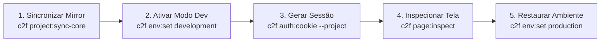

# REQUISICAO HUMANA REQ-022 / BATCH-025

*   **Status**: `READY-FOR-IMPLEMENTATION`
*   **Data de Criação**: 2026-08-26
*   **Solicitante**: Engenheiro Chefe, a partir de relatório operacional do Executor IA no projeto `lumix` (`snapphoton-local`)
*   **Repositórios Alvo**: `conn2flow-ai-workspace`, `conn2flow`, `lumix`, `transformamp`, `conn2flow-site`
*   **Escopo**: Refinamento canônico da skill `c2f-agent-visual-inspection` em todos os templates e masters (PT-BR e EN), estabelecendo o **Ciclo de Vida Canônico de 5 Etapas** (sincronização de mirror via `project:sync-core`, ativação de dev env, autenticação server-side via Docker, inspeção headless e restauração obrigatória do ambiente / tear down) com guia de troubleshooting.

---

## 🎯 1. Contexto & Nuances Operacionais

Durante os testes reais de inspeção no projeto `lumix` (`snapphoton-local`), três necessidades operacionais foram consolidadas:

1. **Sincronização Prévia do Core nos Mirrors**:
   - Os sites locais rodam a partir de mirrors em `dev-environment/data/sites/localhost/<site>/`.
   - Se o Core (`conn2flow`) recebeu alterações recentes (ex: novas funções de sanitização ou cookies), o espelho precisa ser sincronizado com `c2f project:sync-core <projectID>` antes do teste para evitar falsos negativos.

2. **Geração de Autenticação Server-Side via Docker**:
   - Os mirrors locais utilizam `DB_HOST=mysql` no `.env`.
   - O comando `c2f auth:cookie --project=<projectID>` conecta ao banco dentro do container Docker `conn2flow-app` e grava o cookie jar assinado em `temp/agent-cookies.txt`.

3. **Restauração Obrigatória do Ambiente (Tear Down)**:
   - Ao término da inspeção, o ambiente local não deve ser deixado em `DEVELOPMENT_ENV=true` inadvertidamente. A skill deve exigir a restauração para `production` e a limpeza de credenciais temporárias.

---

## 🛠️ 2. Especificação Canônica da Skill `c2f-agent-visual-inspection`

Atualizar o arquivo `c2f-agent-visual-inspection/SKILL.md` em todos os templates em `templates/pt-br/`, `templates/en/` e nos diretórios master (`.claude/skills/`, `.cursor/skills/`, `.gemini/skills/`, `.github/skills/`, `.codex/skills/`):

### Estrutura Canônica em Português (`templates/pt-br/`):
```markdown
---
name: c2f-agent-visual-inspection
description: "LEIA OBRIGATORIAMENTE antes de validar visualmente telas, animações CSS, erros de console ou rotas autenticadas do Gestor no ambiente local de testes. Elimina a necessidade de intervenção humana para checagem visual."
user-invocable: false
---

# Inspeção e Validação Visual Automatizada no Ambiente Local Conn2Flow

# ⚡ Gatilho Obrigatório
- **TRIGGER**: Validar renderização visual, estilos computados (`getComputedStyle`), animações CSS (`getAnimations`), erros de console JavaScript ou rotas autenticadas do Gestor no ambiente local de testes (Docker).
- **SKIP APENAS SE**: Tarefas puramente de backend CLI ou migrations sem renderização de tela.
- **CONSEQUÊNCIA DE IGNORAR**: Deixar itens pendentes como "aguarda homologação visual do operador", gastando rodadas extras de contexto e mascarando bugs visuais (ex: `@media (prefers-reduced-motion)` ou classes CSS ocultas).

---

## 🔄 Ciclo de Vida Canônico de 5 Etapas



### Protocolo Passo a Passo:

#### Passo 1: Sincronização do Mirror (Se o Core foi modificado)
```bash
./c2f project:sync-core <projectID>
```
*Garante que o espelho de teste local (`dev-environment/data/sites/localhost/<site>/`) possui as funções e bibliotecas mais recentes do Core.*

#### Passo 2: Ativação do Modo de Desenvolvimento
```bash
./c2f env:set development --project=<projectID>
```
*Habilita leitura direta de recursos em disco (`resources/`) e relaxamento seguro de cookies em conexões HTTP locais.*

#### Passo 3: Geração do Cookie Jar Server-Side
```bash
./c2f auth:cookie --project=<projectID>
```
*Gera `temp/agent-cookies.txt` com as credenciais de sessão assinadas pelo runtime dentro do container Docker.*

#### Passo 4: Inspeção Visual e Coleta de Evidências
```bash
./c2f page:inspect "http://localhost/<site>/<rota>" --selector="<seletor>" --computed="display,opacity,transform" --screenshot
```
*Executa o Chrome Headless via Playwright, injeta os cookies da sessão e devolve JSON com status HTTP, erros de console JS, estilos computados e screenshot PNG.*

#### Passo 5: Restauração do Ambiente (Tear Down Obrigatório)
```bash
./c2f env:set production --project=<projectID>
```
*Restaura o modo de produção no `.env` do projeto e encerra o ciclo de teste com segurança.*

---

## 🛠️ Guia de Resolução de Problemas (Troubleshooting)

1. **`DB_HOST=mysql` & Conectividade de Banco**:
   - Os comandos que acessam banco (`auth:cookie`, `db:test`) dependem do container Docker `conn2flow-app` / `mysql` ativo.
2. **`503 .env not found`**:
   - Se o projeto não localizar o arquivo `.env`, certifique-se de passar `--project=<projectID>` e verificar se `path_tests` está configurado corretamente em `dev-environment/data/environment.json`.
3. **Falsos Negativos por Core Desatualizado**:
   - Se uma nova função do core não for encontrada durante a execução da página no mirror, execute imediatamente o **Passo 1** (`./c2f project:sync-core <projectID>`).

---

## ⛔ Regras Invioláveis de Inspeção:
1. **EXCLUSIVO PARA AMBIENTE LOCAL DE TESTES**: NUNCA execute inspeção, auth ou scraping automatizado em URLs de produção.
2. **Registro no SDD**: As evidências de inspeção (JSON do `page:inspect` e screenshots) DEVEM ser registradas diretamente no `VALIDATION-CHECKLIST.md` do repositório em vez de marcar "pendente do operador".
3. **Tear Down Obrigatório**: SEMPRE finalize restaurando o ambiente com `c2f env:set production --project=<projectID>`.
```

---

## 📋 Checklist de Execução

- [ ] Atualizar `c2f-agent-visual-inspection/SKILL.md` nos 5 diretórios master (`.claude/`, `.cursor/`, `.gemini/`, `.github/`, `.codex/`) com o ciclo de 5 etapas e troubleshooting.
- [ ] Atualizar `c2f-agent-visual-inspection/SKILL.md` em todos os 14 templates em `templates/pt-br/` e `templates/en/`.
- [ ] Atualizar `docs/pt-br/CATALOGO-DE-SKILLS.md` e `docs/en/SKILLS-CATALOG.md` refinando a descrição da skill 34.
- [ ] Executar `scripts/sync-all-repos.ps1` com `-Force` para propagar nos 4 repositórios alvo (`conn2flow`, `lumix`, `transformamp`, `conn2flow-site`).
- [ ] Validar com `php cli/c2f.php ai:sync` em todos os repositórios.
- [ ] Commitar e sincronizar no Git em todos os repositórios com `git add <caminhos-específicos>`.
