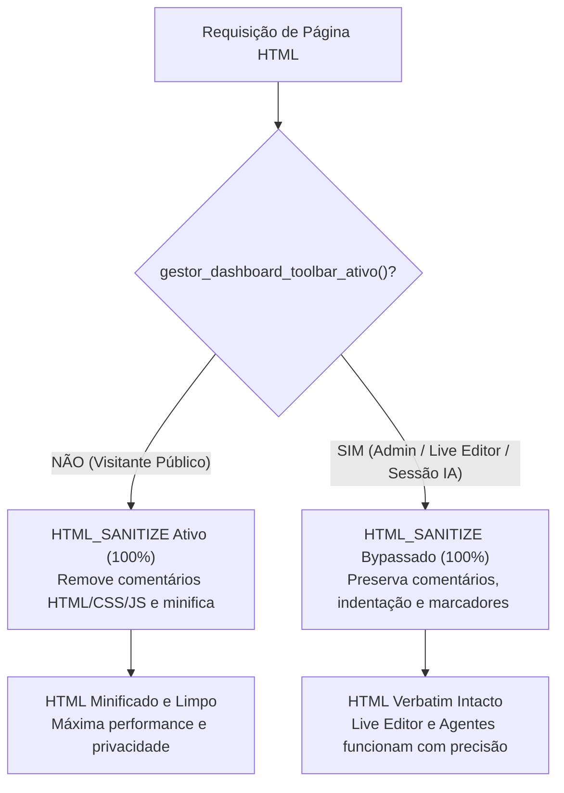

# REQUISICAO HUMANA REQ-024 / BATCH-026

*   **Status**: `COMPLETED`
*   **Data de Criação**: 2026-08-26
*   **Solicitante**: Engenheiro Chefe / Arquiteto do Core
*   **Repositórios Alvo**: `conn2flow-ai-workspace`, `conn2flow`, `lumix`, `transformamp`, `conn2flow-site`
*   **Escopo**: 
    1. Governança e formalização da regra de **Bypass do `HTML_SANITIZE` em Modo Administrador / Live Editor / Sessões de IA** nas Core Skills (`c2f-html-css-pages-and-components`, `c2f-agent-visual-inspection`, `c2f-environment-configuration` e `c2f-gestor-functions`);
    2. Atualização dos catálogos de skills e documentação bilíngue em `docs/pt-br/` e `docs/en/`;
    3. Propagação universal nos 5 kits de IA em todos os repositórios.

---

## 🎯 1. Diagnóstico do Problema & Causa Raiz

No `BATCH-134` (`req-132.md` do core `conn2flow`), foi introduzida a higienização e minificação automática do HTML (`gestor_html_higienizar()`), controlada pela variável `HTML_SANITIZE` no `.env`.

Essa rotina remove comentários de HTML (`<!-- ... -->`), CSS (`/* ... */`), JavaScript (`// ...` e `/* ... */`) e compacta espaços em branco. Porém, quando aplicada indiscriminadamente, gerava dois efeitos colaterais críticos:

1. **Quebra dos Marcadores do Live Editor / Editbar**:
   - Ao apagar comentários estruturais como `<!-- widgets#... -->` e `<!-- /widgets#... -->`, o JavaScript do Live Editor (`dashboard.toolbar.js`) não encontrava as fronteiras dos blocos e deixava de desenhar a caixa de seleção de edição de widgets.
2. **Perda de Contexto para Agentes de IA**:
   - Agentes que executam tarefas de inspeção visual autônoma (`c2f page:inspect`), depuração e edição no Live Editor dependem dos comentários originais de arquitetura, seções (`data-id`, `data-title`) e notas de layout no DOM para correlacionar o código com a página viva.

---

## 🛠️ 2. A Regra Arquitetural de 2 Níveis do `HTML_SANITIZE`

### Regra 1: Visitante Público / Anônimo (`gestor_dashboard_toolbar_ativo() === false`)
* `gestor_pagina_widgets()` não injeta marcadores de widgets.
* `gestor_html_higienizar()` executa **100%**, removendo todos os comentários e compactando o código.
* **Resultado**: Segurança, privacidade e performance máxima para o público geral (zero vazamento de comentários internos).

### Regra 2: Administrador Autenticado / Live Editor / Sessão IA (`gestor_dashboard_toolbar_ativo() === true`)
* `gestor_pagina_higienizar_ativo()` retorna **`false` incondicionalmente**.
* O sanitizador de HTML é **100% BYPASSADO / DESLIGADO**.
* **Resultado**: O HTML é entregue **exatamente como no original** — com todos os comentários de raciocínio, notas de arquitetura, formatação, CSS/JS intactos e marcadores de widgets preservados.

---

## 📦 3. Entregáveis no `conn2flow-ai-workspace`

1. **Atualização da Skill `c2f-html-css-pages-and-components/SKILL.md`**:
   - Incluir a seção formal sobre a regra de 2 níveis do `HTML_SANITIZE` e a preservação de comentários e marcadores de widgets no Live Editor.
2. **Atualização da Skill `c2f-agent-visual-inspection/SKILL.md`**:
   - Documentar que ao inspecionar telas com sessão autenticada (`c2f auth:cookie`), o agente receberá o HTML com comentários e marcadores intactos, facilitando a correlação estrutural com o código-fonte.
3. **Atualização da Skill `c2f-environment-configuration/SKILL.md`**:
   - Documentar a flag `HTML_SANITIZE` (padrão `true` em produção, com bypass automático para administradores).
4. **Atualização dos Catálogos de Documentação**:
   - Atualizar `docs/pt-br/CATALOGO-DE-SKILLS.md` e `docs/en/SKILLS-CATALOG.md`.
5. **Propagação Universal com `-Force`**:
   - Propagar as alterações via `sync-all-repos.ps1` em `conn2flow`, `lumix`, `transformamp` e `conn2flow-site`.

---

## 📋 Checklist de Execução

- [ ] Atualizar `c2f-html-css-pages-and-components/SKILL.md` em todos os templates e masters com a regra de 2 níveis do `HTML_SANITIZE`.
- [ ] Atualizar `c2f-agent-visual-inspection/SKILL.md` documentando a preservação do DOM em sessões autenticadas.
- [ ] Atualizar `c2f-environment-configuration/SKILL.md` com a governança da flag `HTML_SANITIZE`.
- [ ] Atualizar `docs/pt-br/CATALOGO-DE-SKILLS.md` e `docs/en/SKILLS-CATALOG.md`.
- [ ] Executar `scripts/sync-all-repos.ps1` com `-Force` para propagar nos 4 repositórios alvo.
- [ ] Validar com `php cli/c2f.php ai:sync` em todos os repositórios.
- [ ] Commitar e sincronizar no Git em todos os repositórios com `git add <caminhos-específicos>`.
