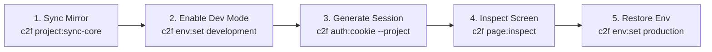

# Automated Visual Inspection and Validation in Conn2Flow Local Environment

# ⚡ Mandatory Trigger
- **TRIGGER**: Validating visual rendering, computed styles (`getComputedStyle`), CSS animations (`getAnimations`), JavaScript console errors, or authenticated Gestor routes in the local test environment (Docker).
- **SKIP ONLY IF**: Purely backend CLI or migration tasks without screen rendering.
- **CONSEQUENCE OF IGNORING**: Leaving items pending as "awaiting operator visual sign-off", consuming extra context rounds and masking visual bugs (e.g. `@media (prefers-reduced-motion)` or hidden CSS classes).

---

## 🔄 Canonical 5-Stage Lifecycle



### Step-by-Step Protocol:

#### Step 1: Mirror Synchronization (If Core was modified)
```bash
./c2f project:sync-core <projectID>
```
*Ensures the local test mirror (`dev-environment/data/sites/localhost/<site>/`) has the latest functions and libraries from Core.*

#### Step 2: Enable Development Mode
```bash
./c2f env:set development --project=<projectID>
```
*Enables direct reading of physical disk resources (`resources/`) and secure cookie relaxation over local HTTP.*

#### Step 3: Server-Side Cookie Jar Generation
```bash
./c2f auth:cookie --project=<projectID>
```
*Generates `temp/agent-cookies.txt` with authenticated session credentials from the runtime inside the Docker container.*

#### Step 4: Visual Inspection & Evidence Collection (Verbatim HTML with Sanitization Bypass)
```bash
./c2f page:inspect "http://localhost/<site>/<route>" --selector="<selector>" --computed="display,opacity,transform" --screenshot
```
*Executes Chrome Headless via Playwright, injects session cookies, and returns structured JSON with HTTP status, JS console errors, computed styles, and PNG screenshot.*
> [!NOTE]
> Because the agent session uses administrative authentication (`auth:cookie`), the HTML sanitizer is **automatically bypassed** (`gestor_dashboard_toolbar_ativo() === true`). The agent receives verbatim HTML with architectural comments, section attributes (`data-id`, `data-title`), and widget markers (`<!-- widgets#... -->`) intact.

#### Step 5: Environment Restoration (Mandatory Tear Down)
```bash
./c2f env:set production --project=<projectID>
```
*Restores production mode in project `.env` and safely concludes the test cycle.*

---

## 🛠️ Troubleshooting Guide

1. **`DB_HOST=mysql` & Database Connectivity**:
   - Commands accessing the database (`auth:cookie`, `db:test`) require the `conn2flow-app` / `mysql` Docker containers to be running.
2. **`503 .env not found`**:
   - If the project cannot find `.env`, ensure you pass `--project=<projectID>` and check that `path_tests` is correctly configured in `dev-environment/data/environment.json`.
3. **False Negatives from Outdated Core**:
   - If a new core function is missing during page execution on the mirror, immediately run **Step 1** (`./c2f project:sync-core <projectID>`).

---

## ⛔ Inviolable Inspection Rules:
1. **EXCLUSIVE TO LOCAL TEST ENVIRONMENT**: NEVER execute automated inspection, auth, or scraping against production URLs.
2. **SDD Registration**: Inspection evidence (JSON from `page:inspect` and screenshots) MUST be logged directly into `VALIDATION-CHECKLIST.md` rather than marking "pending operator".
3. **Mandatory Tear Down**: ALWAYS finalize by restoring the environment via `c2f env:set production --project=<projectID>`.
