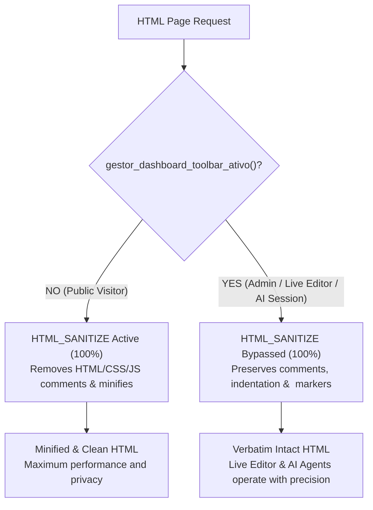

# HTML, CSS and Markdown File Governance in Conn2Flow

# ⚡ Mandatory Trigger
- **TRIGGER**: Writing, editing, or migrating HTML markup, CSS stylesheets, or system layouts.
- **SKIP ONLY IF**: Purely backend PHP logic or API development without visual screen rendering.
- **CONSEQUENCE OF IGNORING**: Creating loose static files that are ignored by the compilation pipeline, never sync to the database, and generate 404 errors in production.

---

> [!WARNING]
> **AGENT WARNING: PROHIBITED TO CREATE LOOSE STATIC FILES**
> NEVER create loose `.html`, `.css`, or `.md` files in the project root, in public static folders (e.g. `public/`, `assets/`), or in PHP module roots!

## 1. Resource System Mandate (`c2f-resources-system`)

In Conn2Flow, **all visual markup and textual content** (pages, layouts, components, templates, variables, and AI prompts) MUST reside within the **Resource System** (`resources/`).

### Where files MUST be placed:

1. **Global Resources**:
   - Pages: `gestor/resources/<language>/pages/<id>/<id>.html`
   - Layouts: `gestor/resources/<language>/layouts/<id>/<id>.html`
   - Components: `gestor/resources/<language>/components/<id>/<id>.html`

2. **Module Resources**:
   - Pages: `modulos/<module-id>/resources/<language>/pages/<id>/<id>.html`
   - Components: `modulos/<module-id>/resources/<language>/components/<id>/<id>.html`

---

## 2. The 2-Tier Architectural Rule for `HTML_SANITIZE`

Conn2Flow implements bifurcated, intelligent HTML delivery controlled by the `HTML_SANITIZE` environment variable in `.env`:

### A. Public / Anonymous Visitor (`gestor_dashboard_toolbar_ativo() === false`):
* `gestor_html_higienizar()` runs **100%**, stripping all comments (`<!-- ... -->`, `/* ... */`, `// ...`) and collapsing whitespace.
* **Result**: Maximum security, privacy, and performance for general visitors (zero leakage of internal notes or structural comments).

### B. Authenticated Administrator / Live Editor / AI Session (`gestor_dashboard_toolbar_ativo() === true`):
* `gestor_pagina_higienizar_ativo()` returns **`false` unconditionally**.
* The HTML sanitizer is **100% BYPASSED / DISABLED**.
* **Result**: HTML is delivered **exactly verbatim** — preserving all architectural comments, section attributes (`data-id`, `data-title`), and Live Editor widget boundaries (`<!-- widgets#... -->` and `<!-- /widgets#... -->`) required for `dashboard.toolbar.js` and automated AI inspection tools.

---

### Mandatory Next Step:
Consult and apply the core skill **`c2f-resources-system`** for compilation (`c2f resources:sync`), JSON metadata, and section structuring (`data-id` and `data-title`).
